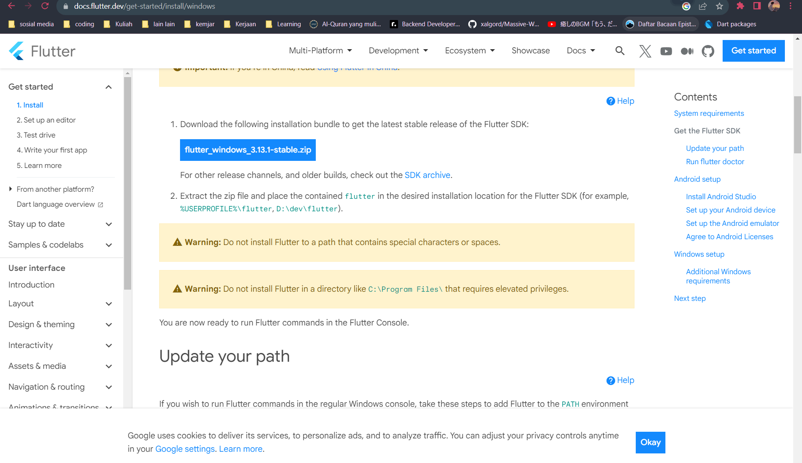
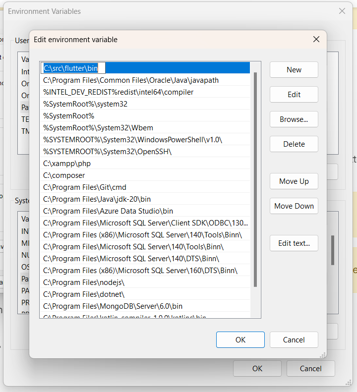
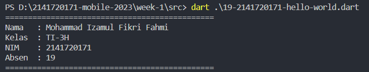

# Week 01 - Dart Hello World

Week 01 fokus pada tahapan install flutter atau dart saja, dan tujuan akhirnya adalah menampilkan "Hello World".

## Authors

- [@izamulfikri](https://www.github.com/izamulfikri)

## Tahapan

### Download Flutter (ini sudah mencakup dart juga)

### Taruh pada folder yang diinginkan (kecuali C:\Program Files)

### Setting Path dan tambahkan folder bin

### Buat file hello world versimu dan jalankan

