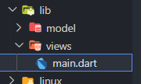
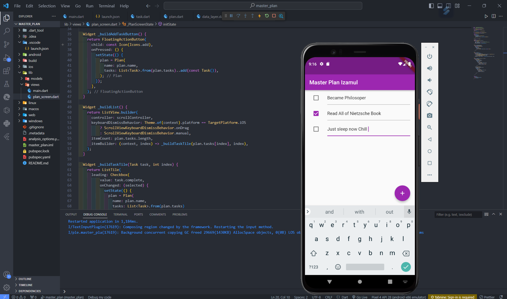
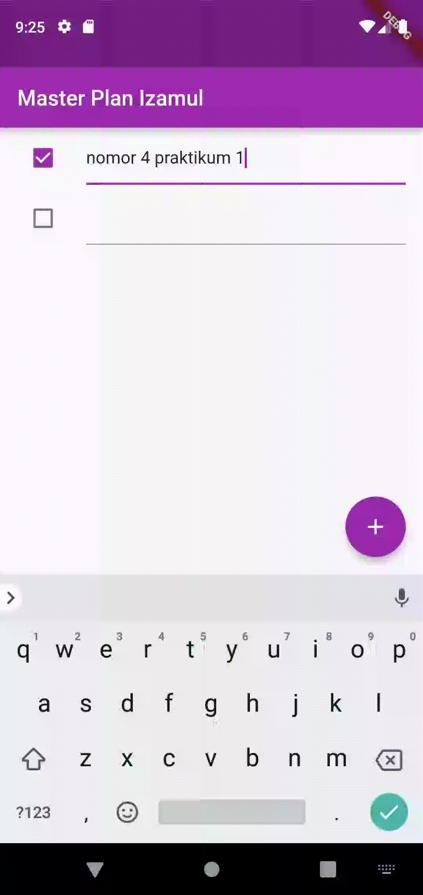
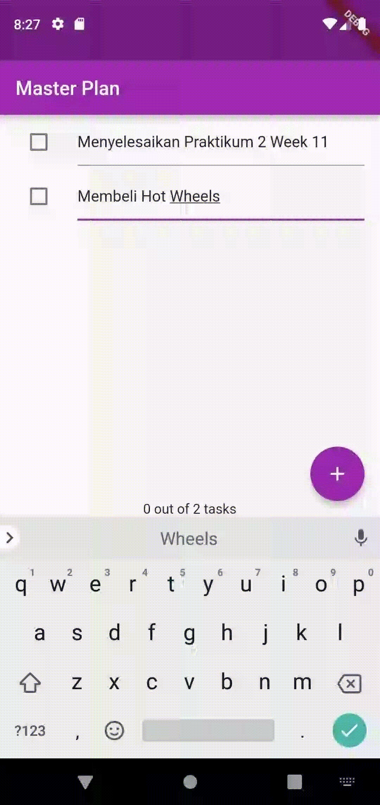

# <div style="color:white; background-color:green; height:50px; margin:auto; text-align:center; padding-top:10px">Week 11 - Dasar State Management</div>


Selesaikan langkah-langkah praktikum berikut ini menggunakan editor Visual Studio Code (VS Code) atau Android Studio atau code editor lain kesukaan Anda.

## Authors

- [@izamulfikri](https://www.github.com/zenosance)

<hr>

## Penjelasan

### 2. Manajemen State

Seiring berkembangnya aplikasi, pengelolaan aliran data melalui aplikasi tersebut menjadi lebih kompleks dan penting. Komunitas Flutter telah merancang beberapa solusi untuk menangani pengelolaan state. Semua solusi ini memiliki satu aspek yang sama: pemisahan UI dan logika bisnis.

Sebelum mendalami bagaimana manajemen state itu bekerja, pada codelab ini Anda akan praktik menggunakan state ke tingkat yang lebih tinggi.

Dalam codelab ini, Anda akan membuat aplikasi pencatatan tugas. Dalam aplikasi ini, pengguna

akan dapat membuat daftar tugas yang berisi banyak tugas. Pengguna akan dapat menambah dan melengkapi tugasnya.

Beberapa topik pembahasan di codelab ini terdiri dari:

- Pemisahan Model-View

- Mengelola data layer dengan InheritedWidget dan InheritedNotifier

- Membuat state aplikasi dapat diakses pada multi screens

### Konsep Model-View

Model dan View merupakan konsep yang sangat penting dalam arsitektur aplikasi flutter. Model adalah kelas yang menangani dengan data untuk suatu aplikasi, sedangkan View adalah kelas yang menampilkan data tersebut di layar.

Di Flutter, View dibuat dari widget. Selanjutnya, model akan menjadi kelas dasar Dart itu yang tidak mewarisi apa pun dari Framework Flutter. Masing-masing kelas ini bertanggung jawab

untuk satu dan hanya satu pekerjaan. Model berkaitan dengan penanganan data untuk aplikasi Anda. View fokus untuk menampilkan UI di layar HP. Ketika Anda konsisten dengan konsep arsitektur model dan view, kode Anda akan menjadi lebih sederhana dan mudah dibaca.

Dalam codelab ini, kita akan membangun aplikasi master_plan dengan membuat kelas model dan view.

# Praktikum 1: Dasar State dengan Model-View

### Langkah 1: Buat Project Baru

Buatlah sebuah project flutter baru dengan nama master_plan di folder src week-11 repository GitHub Anda. Lalu buatlah susunan folder dalam project seperti gambar berikut ini.



### Langkah 2: Membuat model task.dart

Praktik terbaik untuk memulai adalah pada lapisan data (data layer). Ini akan memberi Anda gambaran yang jelas tentang aplikasi Anda, tanpa masuk ke detail antarmuka pengguna Anda. Di folder model, buat file bernama task.dart dan buat class Task. Class ini memiliki atribut description dengan tipe data String dan complete dengan tipe data Boolean, serta ada konstruktor. Kelas ini akan menyimpan data tugas untuk aplikasi kita. Tambahkan kode berikut:

```dart
class Task {
  final String description;
  final bool complete;
  
  const Task({
    this.complete = false,
    this.description = '',
  });
}
```

### Langkah 3: Buat file plan.dart

Kita juga perlu sebuah List untuk menyimpan daftar rencana dalam aplikasi to-do ini. Buat file plan.dart di dalam folder models dan isi kode seperti berikut.

```dart
import './task.dart';

class Plan {
  final String name;
  final List<Task> tasks;
  
  const Plan({this.name = '', this.tasks = const []});
}
```

### Langkah 4: Buat file data_layer.dart

Kita dapat membungkus beberapa data layer ke dalam sebuah file yang nanti akan mengekspor kedua model tersebut. Dengan begitu, proses impor akan lebih ringkas seiring berkembangnya aplikasi. Buat file bernama data_layer.dart di folder models. Kodenya hanya berisi export seperti berikut.


```dart
export 'plan.dart';
export 'task.dart';
```

### Langkah 5: Pindah ke file main.dart

Ubah isi kode main.dart sebagai berikut.

```dart
import 'package:flutter/material.dart';
import './views/plan_screen.dart';

void main() => runApp(MasterPlanApp());

class MasterPlanApp extends StatelessWidget {
  const MasterPlanApp({super.key});

  @override
  Widget build(BuildContext context) {
    return MaterialApp(
     theme: ThemeData(primarySwatch: Colors.purple),
     home: PlanScreen(),
    );
  }
}
```


### Langkah 6: buat plan_screen.dart

Pada folder views, buatlah sebuah file plan_screen.dart dan gunakan templat StatefulWidget untuk membuat class PlanScreen. Isi kodenya adalah sebagai berikut. Gantilah teks ‘Namaku' dengan nama panggilan Anda pada title AppBar.


```dart
import '../models/data_layer.dart';
import 'package:flutter/material.dart';

class PlanScreen extends StatefulWidget {
  const PlanScreen({super.key});

  @override
  State createState() => _PlanScreenState();
}

class _PlanScreenState extends State<PlanScreen> {
  Plan plan = const Plan();

  @override
  Widget build(BuildContext context) {
   return Scaffold(
    // ganti ‘Namaku' dengan Nama panggilan Anda
    appBar: AppBar(title: const Text('Master Plan Namaku')),
    body: _buildList(),
    floatingActionButton: _buildAddTaskButton(),
   );
  }
}
```


### Langkah 7: buat method _buildAddTaskButton()

Anda akan melihat beberapa error di langkah 6, karena method yang belum dibuat. Ayo kita buat mulai dari yang paling mudah yaitu tombol Tambah Rencana. Tambah kode berikut di bawah method build di dalam class _PlanScreenState.


```dart
Widget _buildAddTaskButton() {
  return FloatingActionButton(
   child: const Icon(Icons.add),
   onPressed: () {
     setState(() {
      plan = Plan(
       name: plan.name,
       tasks: List<Task>.from(plan.tasks)
       ..add(const Task()),
     );
    });
   },
  );
}
```

### Langkah 8: buat widget _buildList()

Kita akan buat widget berupa List yang dapat dilakukan scroll, yaitu ListView.builder. Buat widget ListView seperti kode berikut ini.

```dart
Widget _buildList() {
  return ListView.builder(
   itemCount: plan.tasks.length,
   itemBuilder: (context, index) =>
   _buildTaskTile(plan.tasks[index], index),
  );
}
```

### Langkah 9: buat widget _buildTaskTile

Dari langkah 8, kita butuh ListTile untuk menampilkan setiap nilai dari plan.tasks. Kita buat dinamis untuk setiap index data, sehingga membuat view menjadi lebih mudah. Tambahkan kode berikut ini.

```dart
 Widget _buildTaskTile(Task task, int index) {
    return ListTile(
      leading: Checkbox(
          value: task.complete,
          onChanged: (selected) {
            setState(() {
              plan = Plan(
                name: plan.name,
                tasks: List<Task>.from(plan.tasks)
                  ..[index] = Task(
                    description: task.description,
                    complete: selected ?? false,
                  ),
              );
            });
          }),
      title: TextFormField(
        initialValue: task.description,
        onChanged: (text) {
          setState(() {
            plan = Plan(
              name: plan.name,
              tasks: List<Task>.from(plan.tasks)
                ..[index] = Task(
                  description: text,
                  complete: task.complete,
                ),
            );
          });
        },
      ),
    );
  }
```

Run atau tekan F5 untuk melihat hasil aplikasi yang Anda telah buat. Capture hasilnya untuk soal praktikum nomor 4.


### Langkah 10: Tambah Scroll Controller

Anda dapat menambah tugas sebanyak-banyaknya, menandainya jika sudah beres, dan melakukan scroll jika sudah semakin banyak isinya. Namun, ada salah satu fitur tertentu di iOS perlu kita tambahkan. Ketika keyboard tampil, Anda akan kesulitan untuk mengisi yang paling bawah. Untuk mengatasi itu, Anda dapat menggunakan ScrollController untuk menghapus focus dari semua TextField selama event scroll dilakukan. Pada file plan_screen.dart, tambahkan variabel scroll controller di class State tepat setelah variabel plan.


```dart
late ScrollController scrollController;
```

### Langkah 11: Tambah Scroll Listener

Tambahkan method initState() setelah deklarasi variabel scrollController seperti kode berikut.


```dart
@override
void initState() {
  super.initState();
  scrollController = ScrollController()
    ..addListener(() {
      FocusScope.of(context).requestFocus(FocusNode());
    });
}
```

### Langkah 12: Tambah controller dan keyboard behavior

Tambahkan controller dan keyboard behavior pada ListView di method _buildList seperti kode berikut ini.


```dart
return ListView.builder(
  controller: scrollController,
 keyboardDismissBehavior: Theme.of(context).platform ==
 TargetPlatform.iOS
          ? ScrollViewKeyboardDismissBehavior.onDrag
          : ScrollViewKeyboardDismissBehavior.manual,
```


### Langkah 13: Terakhir, tambah method dispose()

Terakhir, tambahkan method dispose() berguna ketika widget sudah tidak digunakan lagi.


```dart
@override
void dispose() {
  scrollController.dispose();
  super.dispose();
}
```

### Langkah 14: Hasil

Lakukan Hot restart (bukan hot reload) pada aplikasi Flutter Anda. Anda akan melihat tampilan akhir seperti gambar berikut. Jika masih terdapat error, silakan diperbaiki hingga bisa running.




<hr>

## Tugas Praktikum 1: Dasar State dengan Model-View

1. Selesaikan langkah-langkah praktikum tersebut, lalu dokumentasikan berupa GIF hasil akhir praktikum beserta penjelasannya di file README.md! Jika Anda menemukan ada yang error atau tidak berjalan dengan baik, silakan diperbaiki.

    **Jawab**: 
    
       Sudah saya sertakan png dan juga gif

2. Jelaskan maksud dari langkah 4 pada praktikum tersebut! Mengapa dilakukan demikian?

    **Jawab**:

        Langkah 4 pada praktikum tersebut dilakukan untuk menyatukan beberapa lapisan data ke dalam satu file agar nantinya dapat diimpor dengan lebih mudah dan ringkas. Langkah ini menggunakan file data_layer.dart di dalam folder models untuk mengekspor dua model yang disebutkan, yaitu plan.dart dan task.dart.

3. Mengapa perlu variabel plan di langkah 6 pada praktikum tersebut? Mengapa dibuat konstanta ?

    **Jawab**:

        Penggunaan variabel plan pada langkah 6 praktikum tersebut bertujuan untuk melacak dan mengelola state (keadaan) dari obyek Plan yang akan digunakan dalam widget PlanScreen. Pemilihan untuk membuatnya sebagai konstanta (const) mungkin terkait dengan inisialisasi awal yang bersifat statis dan tidak berubah selama siklus hidup widget.

4. Lakukan capture hasil dari Langkah 9 berupa GIF, kemudian jelaskan apa yang telah Anda buat!

    **Jawab**:
        Langkah 9 pada praktikum menambahkan widget _buildTaskTile dalam file plan_screen.dart. Widget ini bertanggung jawab untuk menampilkan setiap elemen tugas (plan.tasks) dalam bentuk ListTile. Setiap ListTile terdiri dari sebuah Checkbox untuk menandai status selesai atau belum selesai, dan sebuah TextFormField untuk mengedit atau melihat deskripsi tugas. Ketika nilai Checkbox berubah atau saat deskripsi tugas diubah, fungsi onChanged dijalankan, dan menggunakan setState untuk memperbarui state widget PlanScreen, sehingga perubahan tersebut dapat tercermin dalam antarmuka pengguna (UI).
    
    

5. Apa kegunaan method pada Langkah 11 dan 13 dalam lifecyle state ?
Kumpulkan laporan praktikum Anda berupa link commit atau repository GitHub ke spreadsheet yang telah disediakan!

    **Jawab**:
        
        Langkah 11 menambahkan metode initState pada widget PlanScreen dalam aplikasi Flutter. Metode ini dipanggil saat widget pertama kali dibuat, dan digunakan untuk inisialisasi awal. Pada langkah ini, initState digunakan untuk membuat dan menambahkan listener ke scrollController. Saat pengguna melakukan scroll, listener tersebut memastikan bahwa fokus dari elemen-elemen di layar dihapus, memberikan respons yang lebih baik terhadap interaksi pengguna, terutama saat ada elemen input seperti teks yang sedang aktif.

        Langkah 13 menambahkan metode dispose pada widget yang sama. Metode dispose dipanggil ketika widget tidak lagi digunakan atau dihilangkan dari pohon widget. Pada langkah ini, dispose digunakan untuk membersihkan atau melepaskan sumber daya yang tidak diperlukan. Khususnya, scrollController.dispose() digunakan untuk memastikan bahwa controller yang digunakan untuk mengontrol perilaku ListView juga dibebaskan, membantu mencegah memory leak dan meningkatkan efisiensi aplikasi Flutter secara keseluruhan.


<hr>

# Praktikum 2: Mengelola Data Layer dengan InheritedWidget dan InheritedNotifier

Bagaimana seharusnya Anda mengakses data pada aplikasi?

Beberapa pilihan yang bisa dilakukan adalah meletakkan data dalam satu kelas yang sama sehingga menjadi bagian dari life cycle aplikasi Anda.

Kemudian muncul pertanyaan, bagaimana meletakkan model dalam pohon widget ? sedangkan model bukanlah widget, sehingga tidak akan tampil pada screen.

Solusi yang memungkinkan adalah menggunakan InheritedWidget. Sejauh ini kita hanya menggunakan dua jenis widget, yaitu StatelessWidget dan StatefulWidget. Kedua widget tersebut digunakan untuk layouting UI di screen. Di mana satu bersifat statis dan dinamis. Sedangkan InheritedWidget itu berbeda, ia dapat meneruskan data ke sub-widget turunannya (biasanya ketika Anda menerapkan decomposition widget). Jika dilihat dari perspektif user, itu tidak akan terlihat prosesnya (invisible). InheritedWidget dapat digunakan sebagai pintu untuk komunikasi antara view dan data layers.

Pada codelab ini, kita akan memperbarui kode dari aplikasi Master Plan dengan memisahkan data todo list ke luar class view-nya.

Setelah Anda menyelesaikan praktikum 1, Anda dapat melanjutkan praktikum 2 ini. Selesaikan langkah-langkah praktikum berikut ini menggunakan editor Visual Studio Code (VS Code) atau Android Studio atau code editor lain kesukaan Anda.

### Langkah 1: Buat file plan_provider.dart

Buat folder baru provider di dalam folder lib, lalu buat file baru dengan nama plan_provider.dart berisi kode seperti berikut.

```dart
import 'package:flutter/material.dart';
import '../models/data_layer.dart';

class PlanProvider extends InheritedNotifier<ValueNotifier<Plan>> {
  const PlanProvider({super.key, required Widget child, required
   ValueNotifier<Plan> notifier})
  : super(child: child, notifier: notifier);

  static ValueNotifier<Plan> of(BuildContext context) {
   return context.
    dependOnInheritedWidgetOfExactType<PlanProvider>()!.notifier!;
  }
}
```

### Langkah 2: Edit main.dart

Gantilah pada bagian atribut home dengan PlanProvider seperti berikut. Jangan lupa sesuaikan bagian impor jika dibutuhkan.

```dart
return MaterialApp(
  theme: ThemeData(primarySwatch: Colors.purple),
  home: PlanProvider(
    notifier: ValueNotifier<Plan>(const Plan()),
    child: const PlanScreen(),
   ),
);
```

### Langkah 3: Tambah method pada model plan.dart

Tambahkan dua method di dalam model class Plan seperti kode berikut.

```dart
int get completedCount => tasks
  .where((task) => task.complete)
  .length;

String get completenessMessage =>
  '$completedCount out of ${tasks.length} tasks';
```

### Langkah 4: Pindah ke PlanScreen

Edit PlanScreen agar menggunakan data dari PlanProvider. Hapus deklarasi variabel plan (ini akan membuat error). Kita akan perbaiki pada langkah 5 berikut ini.


### Langkah 5: Edit method _buildAddTaskButton

Tambahkan BuildContext sebagai parameter dan gunakan PlanProvider sebagai sumber datanya. Edit bagian kode seperti berikut.

```dart
Widget _buildAddTaskButton(BuildContext context) {
  ValueNotifier<Plan> planNotifier = PlanProvider.of(context);
  return FloatingActionButton(
    child: const Icon(Icons.add),
    onPressed: () {
      Plan currentPlan = planNotifier.value;
      planNotifier.value = Plan(
        name: currentPlan.name,
        tasks: List<Task>.from(currentPlan.tasks)..add(const Task()),
      );
    },
  );
}
```

### Langkah 6: Edit method _buildTaskTile

Tambahkan parameter BuildContext, gunakan PlanProvider sebagai sumber data. Ganti TextField menjadi TextFormField untuk membuat inisial data provider menjadi lebih mudah.

```dart
Widget _buildTaskTile(Task task, int index, BuildContext context) {
  ValueNotifier<Plan> planNotifier = PlanProvider.of(context);
  return ListTile(
    leading: Checkbox(
       value: task.complete,
       onChanged: (selected) {
         Plan currentPlan = planNotifier.value;
         planNotifier.value = Plan(
           name: currentPlan.name,
           tasks: List<Task>.from(currentPlan.tasks)
             ..[index] = Task(
               description: task.description,
               complete: selected ?? false,
             ),
         );
       }),
    title: TextFormField(
      initialValue: task.description,
      onChanged: (text) {
        Plan currentPlan = planNotifier.value;
        planNotifier.value = Plan(
          name: currentPlan.name,
          tasks: List<Task>.from(currentPlan.tasks)
            ..[index] = Task(
              description: text,
              complete: task.complete,
            ),
        );
      },
    ),
  );
}
```

### Langkah 7: Edit _buildList

Sesuaikan parameter pada bagian _buildTaskTile seperti kode berikut.

```dart
Widget _buildList(Plan plan) {
   return ListView.builder(
     controller: scrollController,
     itemCount: plan.tasks.length,
     itemBuilder: (context, index) =>
        _buildTaskTile(plan.tasks[index], index, context),
   );
}
```

### Langkah 8: Tetap di class PlanScreen

Edit method build sehingga bisa tampil progress pada bagian bawah (footer). Caranya, bungkus (wrap) _buildList dengan widget Expanded dan masukkan ke dalam widget Column seperti kode pada Langkah 9.

### Langkah 9: Tambah widget SafeArea

Terakhir, tambahkan widget SafeArea dengan berisi completenessMessage pada akhir widget Column. Perhatikan kode berikut ini.

```dart
@override
Widget build(BuildContext context) {
   return Scaffold(
     appBar: AppBar(title: const Text('Master Plan')),
     body: ValueListenableBuilder<Plan>(
       valueListenable: PlanProvider.of(context),
       builder: (context, plan, child) {
         return Column(
           children: [
             Expanded(child: _buildList(plan)),
             SafeArea(child: Text(plan.completenessMessage))
           ],
         );
       },
     ),
     floatingActionButton: _buildAddTaskButton(context),
   );
}
```

Akhirnya, run atau tekan F5 jika aplikasi belum running. Tidak akan terlihat perubahan pada UI, namun dengan melakukan langkah-langkah di atas, Anda telah menerapkan cara memisahkan dengan baik antara view dan model. Ini merupakan hal terpenting dalam mengelola state di aplikasi Anda.


## Tugas Praktikum 2: InheritedWidget

1. Selesaikan langkah-langkah praktikum tersebut, lalu dokumentasikan berupa GIF hasil akhir praktikum beserta penjelasannya di file README.md! Jika Anda menemukan ada yang error atau tidak berjalan dengan baik, silakan diperbaiki sesuai dengan tujuan aplikasi tersebut dibuat.

    **Jawab**:

    

2. Jelaskan mana yang dimaksud InheritedWidget pada langkah 1 tersebut! Mengapa yang digunakan InheritedNotifier?

    **Jawab**:

        Langkah 1 memperkenalkan konsep InheritedWidget dalam Flutter melalui pembuatan file plan_provider.dart. InheritedWidget memungkinkan penurunan data ke seluruh subtree widget di dalamnya tanpa perlu menyampaikannya secara langsung. Dalam kasus ini, PlanProvider meng-extend InheritedNotifier<ValueNotifier<Plan>>, menggunakan ValueNotifier yang terkait dengan ChangeNotifier untuk mengelola perubahan state pada objek Plan. Dengan pendekatan ini, widget-widget yang bergantung pada PlanProvider secara otomatis diberitahu dan dirender ulang ketika terjadi perubahan pada objek Plan, menyediakan manajemen state yang efisien dalam aplikasi Flutter.

3. Jelaskan maksud dari method di langkah 3 pada praktikum tersebut! Mengapa dilakukan demikian?

    **Jawab**:

        Langkah 3 pada praktikum tersebut menambahkan dua metode ke dalam kelas model Plan pada file plan.dart. Metode pertama, int get completedCount, mengembalikan jumlah tugas yang telah selesai (yang memiliki properti complete bernilai true). Metode kedua, String get completenessMessage, mengembalikan pesan yang menyatakan sejauh mana kelengkapan tugas, dengan menampilkan jumlah tugas yang telah selesai dari total tugas yang ada.

        Penambahan metode ini bermanfaat untuk memberikan informasi tentang kemajuan atau kelengkapan dari objek Plan dengan cara yang lebih terstruktur. Metode completedCount memberikan nilai numerik tentang berapa banyak tugas yang telah selesai, sementara metode completenessMessage memberikan pesan yang menyajikan informasi tersebut secara lebih deskriptif. Dengan cara ini, aplikasi dapat dengan mudah menampilkan dan menyajikan informasi tentang kemajuan tugas dalam bentuk yang lebih informatif dan mudah dimengerti bagi pengguna.

4. Lakukan capture hasil dari Langkah 9 berupa GIF, kemudian jelaskan apa yang telah Anda buat!

    **Jawab**:

        Langkah 9 menambahkan widget SafeArea pada akhir widget Column dalam aplikasi Flutter. Widget SafeArea digunakan untuk memastikan bahwa elemen-elemen UI yang ditampilkan di layar tidak tumpang tindih dengan area yang aman, seperti notch pada perangkat mobile atau batas layar lainnya. Dalam konteks ini, SafeArea mengandung sebuah teks yang menampilkan pesan kelengkapan tugas dari objek Plan. Penempatan pesan di dalam SafeArea memastikan bahwa informasi tersebut ditampilkan secara aman tanpa terpengaruh oleh area yang tidak dapat digunakan di sekitar layar, sehingga meningkatkan kenyamanan pengguna dalam melihat informasi kemajuan tugas.

      

      

5. Kumpulkan laporan praktikum Anda berupa link commit atau repository GitHub ke spreadsheet yang telah disediakan!

    **Jawab**:

      Siap, sudah

<hr>

# Praktikum 3: Membuat State di Multiple Screens

Satu kalimat populer atau viral yang beredar dalam komunitas Flutter adalah "Lift State Up". Mantra ini merujuk ke sebuah ide di mana objek State seharusnya berada lebih tinggi dari pada widget yang membutuhkannya di dalam sebuah widget tree. InheritedWidget yang telah kita buat sebelumnya bekerja dengan sempurna pada satu screen, tapi apa yang akan terjadi jika kita tambah screen kedua ?

Pada codelab ini, Anda akan menambah screen lain pada aplikasi Master Plan sehingga bisa membuat kelompok daftar plan lebih dari satu.

Selesaikan langkah-langkah praktikum berikut ini menggunakan editor Visual Studio Code (VS Code) atau Android Studio atau code editor lain kesukaan Anda.

### Langkah 1: Edit PlanProvider

Perhatikan kode berikut, edit class PlanProvider sehingga dapat menangani List Plan.

```dart
class PlanProvider extends
InheritedNotifier<ValueNotifier<List<Plan>>> {
  const PlanProvider({super.key, required Widget child, required
ValueNotifier<List<Plan>> notifier})
     : super(child: child, notifier: notifier);

  static ValueNotifier<List<Plan>> of(BuildContext context) {
    return context.
dependOnInheritedWidgetOfExactType<PlanProvider>()!.notifier!;
  }
}
```

### Langkah 2: Edit main.dart

Langkah sebelumnya dapat menyebabkan error pada main.dart dan plan_screen.dart. Pada method build, gantilah menjadi kode seperti ini.

```dart
@override
Widget build(BuildContext context) {
  return PlanProvider(
    notifier: ValueNotifier<List<Plan>>(const []),
    child: MaterialApp(
      title: 'State management app',
      theme: ThemeData(
        primarySwatch: Colors.blue,
      ),
      home: const PlanScreen(),
    ),
  );
}
```

### Langkah 3: Edit plan_screen.dart

Tambahkan variabel plan dan atribut pada constructor-nya seperti berikut.

```dart
final Plan plan;
const PlanScreen({super.key, required this.plan});
```

### Langkah 4: Error

Itu akan terjadi error setiap kali memanggil PlanProvider.of(context). Itu terjadi karena screen saat ini hanya menerima tugas-tugas untuk satu kelompok Plan, tapi sekarang PlanProvider menjadi list dari objek plan tersebut.

### Langkah 5: Tambah getter Plan

Tambahkan getter pada _PlanScreenState seperti kode berikut.

```dart
class _PlanScreenState extends State<PlanScreen> {
  late ScrollController scrollController;
  Plan get plan => widget.plan;
```

### Langkah 6: Method initState()

Pada bagian ini kode tetap seperti berikut.

```dart
@override
void initState() {
   super.initState();
   scrollController = ScrollController()
    ..addListener(() {
      FocusScope.of(context).requestFocus(FocusNode());
    });


}
```

### Langkah 7: Widget build

Pastikan Anda telah merubah ke List dan mengubah nilai pada currentPlan seperti kode berikut ini.

```dart
  @override
  Widget build(BuildContext context) {
    ValueNotifier<List<Plan>> plansNotifier = PlanProvider.of(context);

    return Scaffold(
      appBar: AppBar(title: Text(_plan.name)),
      body: ValueListenableBuilder<List<Plan>>(
        valueListenable: plansNotifier,
        builder: (context, plans, child) {
          Plan currentPlan = plans.firstWhere((p) => p.name == plan.
name);
          return Column(
            children: [
              Expanded(child: _buildList(currentPlan)),
              SafeArea(child: Text(currentPlan.
completenessMessage)),
            ],);},),
      floatingActionButton: _buildAddTaskButton(context,)
  ,);
 }

  Widget _buildAddTaskButton(BuildContext context) {
    ValueNotifier<List<Plan>> planNotifier = PlanProvider.
of(context);
    return FloatingActionButton(
      child: const Icon(Icons.add),
      onPressed: () {
        Plan currentPlan = plan;
        int planIndex =
            planNotifier.value.indexWhere((p) => p.name == currentPlan.name);
        List<Task> updatedTasks = List<Task>.from(currentPlan.tasks)
          ..add(const Task());
        planNotifier.value = List<Plan>.from(planNotifier.value)
          ..[planIndex] = Plan(
            name: currentPlan.name,
            tasks: updatedTasks,
          );
        plan = Plan(
          name: currentPlan.name,
          tasks: updatedTasks,
        );},);
  }
```

### Langkah 8: Edit _buildTaskTile

Pastikan ubah ke List dan variabel planNotifier seperti kode berikut ini.

```dart
 Widget _buildTaskTile(Task task, int index, BuildContext context)
{
    ValueNotifier<List<Plan>> planNotifier = PlanProvider.
of(context);

    return ListTile(
      leading: Checkbox(
         value: task.complete,
         onChanged: (selected) {
           Plan currentPlan = plan;
           int planIndex = planNotifier.value
              .indexWhere((p) => p.name == currentPlan.name);
           planNotifier.value = List<Plan>.from(planNotifier.value)
             ..[planIndex] = Plan(
               name: currentPlan.name,
               tasks: List<Task>.from(currentPlan.tasks)
                 ..[index] = Task(
                   description: task.description,
                   complete: selected ?? false,
                 ),);
         }),
      title: TextFormField(
        initialValue: task.description,
        onChanged: (text) {
          Plan currentPlan = plan;
          int planIndex =
             planNotifier.value.indexWhere((p) => p.name ==
currentPlan.name);
          planNotifier.value = List<Plan>.from(planNotifier.value)
            ..[planIndex] = Plan(
              name: currentPlan.name,
              tasks: List<Task>.from(currentPlan.tasks)
                ..[index] = Task(
                  description: text,
                  complete: task.complete,
                ),
            );
},),);}
```

### Langkah 9: Buat screen baru

Pada folder view, buatlah file baru dengan nama plan_creator_screen.dart dan deklarasikan dengan StatefulWidget bernama PlanCreatorScreen. Gantilah di main.dart pada atribut home menjadi seperti berikut.

```dart
home: const PlanCreatorScreen(),
```

### Langkah 10: Pindah ke class _PlanCreatorScreenState

Kita perlu tambahkan variabel TextEditingController sehingga bisa membuat TextField sederhana untuk menambah Plan baru. Jangan lupa tambahkan dispose ketika widget unmounted seperti kode berikut.

```dart
final textController = TextEditingController();

@override
void dispose() {
  textController.dispose();
  super.dispose();
}
```

### Langkah 11: Pindah ke method build

Letakkan method Widget build berikut di atas void dispose. Gantilah ‘Namaku' dengan nama panggilan Anda.

```dart
@override
Widget build(BuildContext context) {
  return Scaffold(
    // ganti ‘Namaku' dengan nama panggilan Anda
    appBar: AppBar(title: const Text('Master Plans Namaku')),
    body: Column(children: [
      _buildListCreator(),
      Expanded(child: _buildMasterPlans())
    ]),
  );
}
```

### Langkah 12: Buat widget _buildListCreator

Buatlah widget berikut setelah widget build.

```dart
Widget _buildListCreator() {
  return Padding(
     padding: const EdgeInsets.all(20.0),
     child: Material(
       color: Theme.of(context).cardColor,
       elevation: 10,
       child: TextField(
          controller: textController,
          decoration: const InputDecoration(
             labelText: 'Add a plan',
             contentPadding: EdgeInsets.all(20)),
          onEditingComplete: addPlan),
     ));
}
```

### Langkah 13: Buat void addPlan()

Tambahkan method berikut untuk menerima inputan dari user berupa text plan.

```dart
void addPlan() {
  final text = textController.text;
    if (text.isEmpty) {
      return;
    }
    final plan = Plan(name: text, tasks: []);
    ValueNotifier<List<Plan>> planNotifier =
PlanProvider.of(context);
    planNotifier.value = List<Plan>.from(planNotifier.value)..
add(plan);
    textController.clear();
    FocusScope.of(context).requestFocus(FocusNode());
    setState(() {});
}
```

### Langkah 14: Buat widget _buildMasterPlans()

Tambahkan widget seperti kode berikut.


```dart
Widget _buildMasterPlans() {
  ValueNotifier<List<Plan>> planNotifier = PlanProvider.of(context);
    List<Plan> plans = planNotifier.value;

    if (plans.isEmpty) {
      return Column(
         mainAxisAlignment: MainAxisAlignment.center,
         children: <Widget>[
           const Icon(Icons.note, size: 100, color: Colors.grey),
           Text('Anda belum memiliki rencana apapun.',
              style: Theme.of(context).textTheme.headlineSmall)
         ]);
    }
    return ListView.builder(
        itemCount: plans.length,
        itemBuilder: (context, index) {
          final plan = plans[index];
          return ListTile(
              title: Text(plan.name),
              subtitle: Text(plan.completenessMessage),
              onTap: () {
                Navigator.of(context).push(
                   MaterialPageRoute(builder: (_) =>
PlanScreen(plan: plan,)));
              });
        });
}
```

Terakhir, run atau tekan F5 untuk melihat hasilnya jika memang belum running. Bisa juga lakukan hot restart jika aplikasi sudah running. Maka hasilnya akan seperti gambar berikut ini.


## Tugas Praktikum 3: State di Multiple Screens

