# <div style="color:white; background-color:green; height:50px; margin:auto; text-align:center; padding-top:10px">Week 12 - Pemrograman Asynchronous</div>

## Authors

- [@izamulfikri](https://www.github.com/zenosance)

<hr>

## Praktikum 1: Mengunduh Data dari Web Service (API)

Selesaikan langkah-langkah praktikum berikut ini menggunakan editor Visual Studio Code (VS Code) atau Android Studio atau code editor lain kesukaan Anda. Jawablah di laporan praktikum Anda pada setiap soal yang ada di beberapa langkah praktikum ini.

        Perhatian: Diasumsikan Anda telah berhasil melakukan setup environment Flutter SDK, VS Code, Flutter Plugin, dan Android SDK pada pertemuan pertama.

### Langkah 1: Buat Project Baru

Buatlah sebuah project flutter baru dengan nama books di folder src week-12 repository GitHub Anda.

Kemudian Tambahkan dependensi http dengan mengetik perintah berikut di terminal.

```dart
flutter pub add http
```

### Langkah 2: Cek file pubspec.yaml

Jika berhasil install plugin, pastikan plugin http telah ada di file pubspec ini seperti berikut.

```dart
dependencies:
  flutter:
    sdk: flutter
  http: ^1.1.0
```

Jika Anda menggunakan macOS, Anda harus mengaktifkan fitur networking pada file macos/Runner/DebugProfile.entitlements dan macos/Runner/Release.entitlements dengan menambahkan kode berikut:

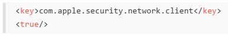

### Langkah 3: Buka file main.dart

Ketiklah kode seperti berikut ini.

<aside style="color:white; background-color:green;"><h3 is-upgraded=""><strong>Soal 1</strong></h3>Tambahkan nama panggilan Anda pada title app sebagai identitas hasil pekerjaan Anda.
</aside>

<br>

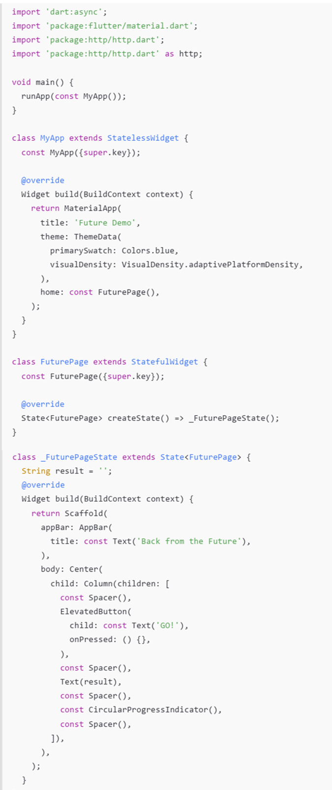

        Catatan:

        Tidak ada yang spesial dengan kode di main.dart tersebut. Perlu diperhatikan di kode tersebut terdapat widget CircularProgressIndicator yang akan menampilkan animasi berputar secara terus-menerus, itu pertanda bagus bahwa aplikasi Anda responsif (tidak freeze/lag). Ketika animasi terlihat berhenti, itu berarti UI menunggu proses lain sampai selesai.

### Jawab Soal 1

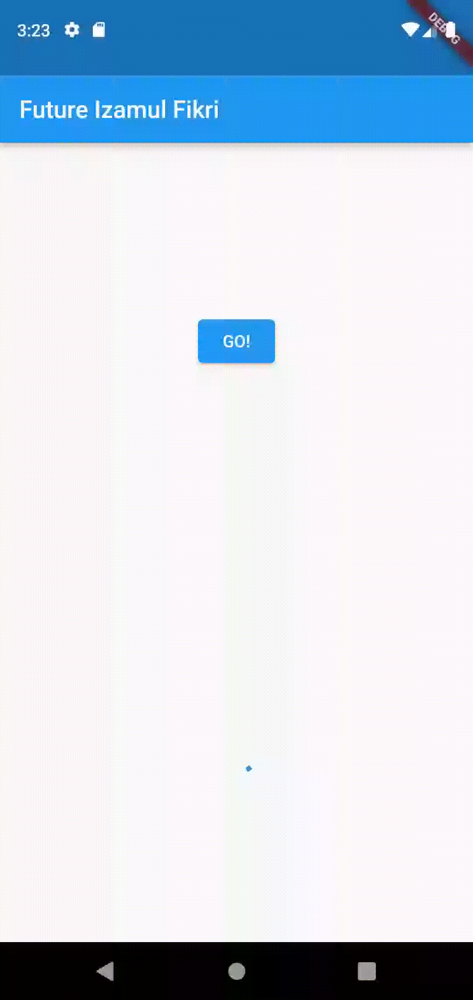

### Langkah 4: Tambah method getData()

Tambahkan method ini ke dalam class \_FuturePageState yang berguna untuk mengambil data dari API Google Books.

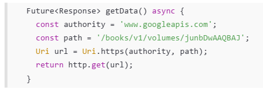

<aside style="color:white; background-color:green;"><h3 is-upgraded=""><strong>Soal 2</strong></h3>
<ul>
<li>Carilah judul buku favorit Anda di Google Books, lalu ganti ID buku pada variabel <code>path</code> di kode tersebut. Caranya ambil di URL browser Anda seperti gambar berikut ini.<br>
<p class="image-container"></p>
</li>
</ul>
<ul>
<li>Kemudian cobalah akses di browser URI tersebut dengan lengkap seperti ini. Jika menampilkan data JSON, maka Anda telah berhasil. Lakukan <em>capture </em>milik Anda dan tulis di <code>README</code> pada laporan praktikum. Lalu lakukan commit dengan pesan "<strong>W12: Soal 2</strong>".<br>
<p class="image-container">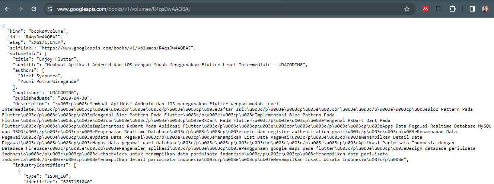</p>
</li>
</ul>
</aside>

### Jawab Soal 2

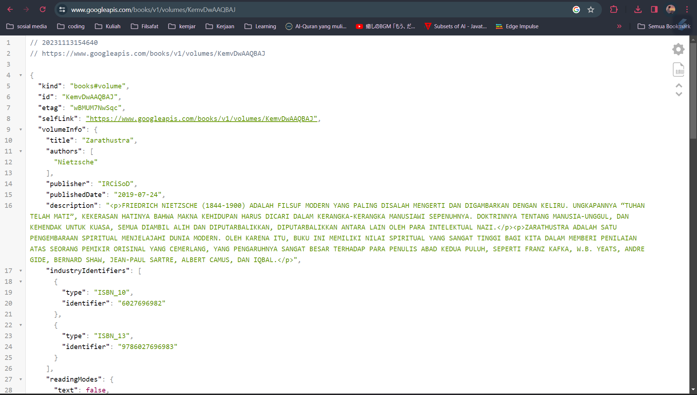

### Langkah 5: Tambah kode di ElevatedButton

Tambahkan kode pada onPressed di ElevatedButton seperti berikut.

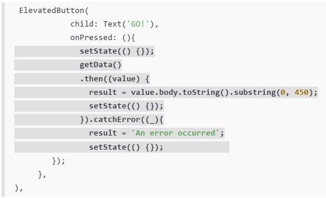

Lakukan run aplikasi Flutter Anda. Anda akan melihat tampilan akhir seperti gambar berikut. Jika masih terdapat error, silakan diperbaiki hingga bisa running.

<aside style="color:white; background-color:green;"><h3 is-upgraded=""><strong>Soal 3</strong></h3>
<ul>
<li>Jelaskan maksud kode langkah 5 tersebut terkait substring dan catchError!
</li>
<li>Capture hasil praktikum Anda berupa GIF dan lampirkan di README. Lalu lakukan commit dengan pesan "W12: Soal 3".</li>
</ul>
</aside>

### Jawab Soal 3

        Pada langkah 5, dalam pengaturan tombol ElevatedButton, kode substring(0, 450) digunakan untuk memotong atau mengambil sebagian dari string hasil respons data. Hal ini dapat bermanfaat untuk membatasi panjang string yang ditampilkan atau mempertahankan hanya sejumlah karakter tertentu. Sementara itu, catchError((_){}) berfungsi untuk menangani kesalahan yang mungkin terjadi selama proses pengambilan data. Jika terjadi kesalahan, pesan "An error occurred" akan ditetapkan ke variabel result, dan antarmuka pengguna akan diperbarui dengan menggunakan setState(). Ini membantu meningkatkan ketahanan aplikasi terhadap kesalahan selama eksekusi dan memberikan umpan balik yang sesuai kepada pengguna.

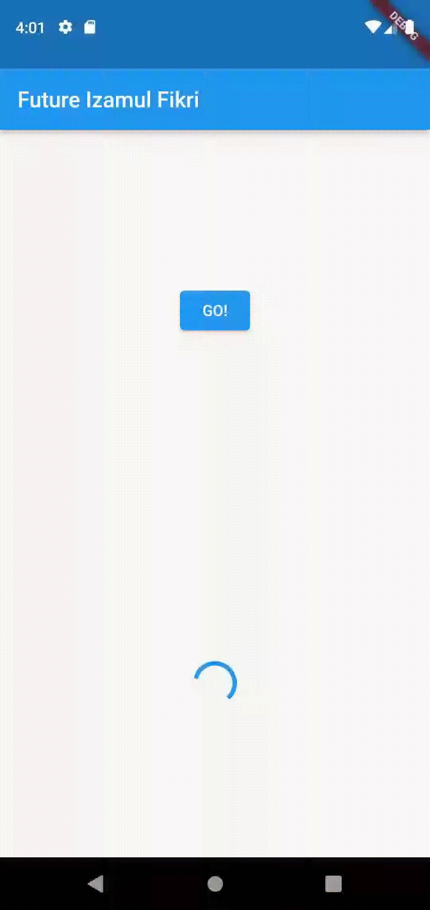

<hr>

## Praktikum 2: Menggunakan await/async untuk menghindari callbacks

Ada alternatif penggunaan Future yang lebih clean, mudah dibaca dan dirawat, yaitu pola async/await. Intinya pada dua kata kunci ini:

- async digunakan untuk menandai suatu method sebagai asynchronous dan itu harus ditambahkan di depan kode function.
- await digunakan untuk memerintahkan menunggu sampai eksekusi suatu function itu selesai dan mengembalikan sebuah value. Untuk then bisa digunakan pada jenis method apapun, sedangkan await hanya bekerja di dalam method async.

Berikut ini contoh kode perbedaan Future dengan then dan async/await.

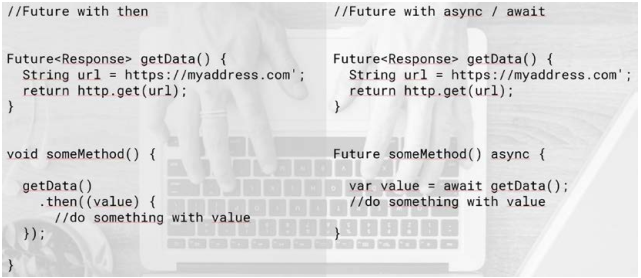

untuk pemahaman lebih lanjut dapat mengecek video berikut [klik link](https://youtu.be/SmTCmDMi4BY)

Setelah Anda menyelesaikan praktikum 1, Anda dapat melanjutkan praktikum 2 ini. Selesaikan langkah-langkah praktikum berikut ini menggunakan editor Visual Studio Code (VS Code) atau Android Studio atau code editor lain kesukaan Anda. Jawablah di laporan praktikum Anda pada setiap soal yang ada di beberapa langkah praktikum ini.

### Langkah 1: Buka file main.dart

Tambahkan tiga method berisi kode seperti berikut di dalam class \_FuturePageState.

```dart
Future<int> returnOneAsync() async {
  await Future.delayed(const Duration(seconds: 3));
  return 1;
}

Future<int> returnTwoAsync() async {
  await Future.delayed(const Duration(seconds: 3));
  return 2;
}

Future<int> returnThreeAsync() async {
  await Future.delayed(const Duration(seconds: 3));
  return 3;
}
```

### Langkah 2: Tambah Method count()

Lalu tambahkan lagi method ini di bawah ketiga method sebelumnya.

```dart
  Future count() async {
    int total = 0;
    total = await returnOneAsync();
    total += await returnTwoAsync();
    total += await returnThreeAsync();
    setState((){
      result = total.toString();
    });
  }
```

### Langkah 3: Panggil count()

Lakukan comment kode sebelumnya, ubah isi kode onPressed() menjadi seperti berikut.

```dart
 ElevatedButton(
            child: const Text('GO!'),
            onPressed: () {
              count();
              // setState(() {});
              // getData().then((value) {
              //   result = value.body.toString().substring(0, 450);
              //   setState(() {});
              // }).catchError((_) {
              //   result = "An error occurred";
              //   setState(() {});
              // });
            },
          ),
```

### Langkah 4: Run

Akhirnya, run atau tekan F5 jika aplikasi belum running. Maka Anda akan melihat seperti gambar berikut, hasil angka 6 akan tampil setelah delay 9 detik.

<aside style="color:white; background-color:green;"><h3 is-upgraded=""><strong>Soal 4</strong></h3>
<ul>
<li>Jelaskan maksud kode langkah 1 dan 2 tersebut!
</li>
<li>Capture hasil praktikum Anda berupa GIF dan lampirkan di README. Lalu lakukan commit dengan pesan "W12: Soal 4".
</li>
</ul>
</aside>

### Jawab Soal 4

            Langkah 1 pada kode di main.dart mengenai penambahan tiga metode returnOneAsync(), returnTwoAsync(), dan returnThreeAsync() di dalam kelas _FuturePageState. Ketiga metode ini adalah metode asinkron yang menggunakan kata kunci async dan menetapkan nilai yang ditunda melalui Future.delayed. Setiap metode mengembalikan nilai yang berbeda setelah penundaan waktu selama 3 detik.

            Langkah 2 menambahkan metode count() di bawah ketiga metode sebelumnya. Metode count() berfungsi untuk menjumlahkan nilai yang dikembalikan oleh ketiga metode asinkron tersebut. Proses penjumlahan dilakukan secara berurutan, dimulai dari returnOneAsync(), diikuti returnTwoAsync(), dan terakhir returnThreeAsync(). Hasil penjumlahan kemudian disimpan dalam variabel total dan diperbarui ke antarmuka pengguna melalui setState() dengan menetapkan nilai result menjadi total yang diubah menjadi string. Seluruh proses ini dilakukan secara asinkron untuk memastikan tidak terjadi blocking pada antarmuka pengguna selama penundaan waktu yang diperlukan oleh metode asinkron.


<hr>

## Praktikum 3: Menggunakan Completer di Future

Menggunakan Future dengan then, catchError, async, dan await mungkin sudah cukup untuk banyak kasus, tetapi ada alternatif melakukan operasi async di Dart dan Flutter yaitu dengan class Completer.

Completer membuat object Future yang mana Anda dapat menyelesaikannya nanti (late) dengan return sebuah value atau error.

Setelah Anda menyelesaikan praktikum 2, Anda dapat melanjutkan praktikum 3 ini. Selesaikan langkah-langkah praktikum berikut ini menggunakan editor Visual Studio Code (VS Code) atau Android Studio atau code editor lain kesukaan Anda. Jawablah di laporan praktikum Anda pada setiap soal yang ada di beberapa langkah praktikum ini.

### Langkah 1: Buka main.dart

Pastikan telah impor package async berikut.

```dart
import 'package:async/async.dart';
```

### Langkah 2: Tambahkan variabel dan method

Tambahkan variabel late dan method di class \_FuturePageState seperti ini.

```dart
late Completer completer;

Future getNumber() {
  completer = Completer<int>();
  calculate();
  return completer.future;
}

Future calculate() async {
  await Future.delayed(const Duration(seconds : 5));
  completer.complete(42);
}
```

### Langkah 3: Ganti isi kode onPressed()

Tambahkan kode berikut pada fungsi onPressed(). Kode sebelumnya bisa Anda comment.

```dart
getNumber().then((value) {
    setState((){
        result = value.toString();
    });
});
```

### Langkah 4:

Terakhir, run atau tekan F5 untuk melihat hasilnya jika memang belum running. Bisa juga lakukan hot restart jika aplikasi sudah running. Maka hasilnya akan seperti gambar berikut ini. Setelah 5 detik, maka angka 42 akan tampil.

<aside style="color:white; background-color:green;"><h3 is-upgraded=""><strong>Soal 5</strong></h3>
<ul>
<li>Jelaskan maksud kode langkah 2 tersebut!
</li>
<li>Capture hasil praktikum Anda berupa GIF dan lampirkan di README. Lalu lakukan commit dengan pesan "W12: Soal 5".
</li>
</ul>
</aside>

### Jawab Soal 5

            Pada langkah 2, terdapat penambahan variabel completer dan dua metode baru dalam kelas _FuturePageState. Variabel completer bertipe Completer digunakan untuk mengelola sebuah objek yang akan menyelesaikan atau menolak suatu operasi asinkron di future. Metode getNumber() menginisialisasi completer sebagai objek baru dan kemudian memanggil metode calculate(). Metode calculate() merupakan metode asinkron yang menunda eksekusi selama 5 detik menggunakan Future.delayed dan kemudian menyelesaikan completer dengan nilai 42. Penggunaan Completer memungkinkan kontrol yang lebih baik dalam menangani hasil operasi asinkron, di mana metode getNumber() dapat mengembalikan completer.future untuk mendapatkan nilai yang akan diselesaikan di future.

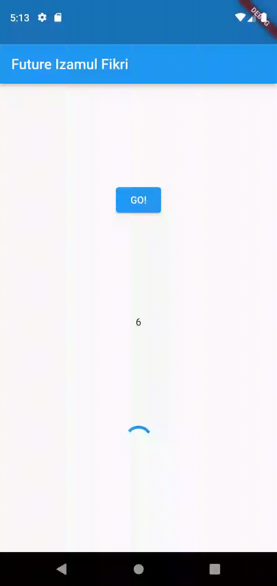

### Langkah 5: Ganti method calculate()

Gantilah isi code method calculate() seperti kode berikut, atau Anda dapat membuat calculate2()

```dart
  Future calculate() async {
    try{
    await Future.delayed(const Duration(seconds: 5));
    completer.complete(42);
    }
    catch(_){
      completer.completeError({});
    }
  }
```

### Langkah 6: Langkah 6: Pindah ke onPressed()

Ganti menjadi kode seperti berikut.

```dart
getNumber().then((value) {
  setState(() {
    result = value.toString();
  });
}).catchError((e) {
  result = 'An error occurred';
});
```

<aside style="color:white; background-color:green;"><h3 is-upgraded=""><strong>Soal 6</strong></h3>
<ul>
<li>Jelaskan maksud perbedaan kode langkah 2 dengan langkah 5-6 tersebut!
</li>
<li>Capture hasil praktikum Anda berupa GIF dan lampirkan di README. Lalu lakukan commit dengan pesan "W12: Soal 6".
</li>
</ul>
</aside>

### Jawab Soal 6

            Pada Langkah 5, perubahan pada method calculate() bertujuan untuk menangani kesalahan yang mungkin terjadi selama eksekusi operasi asinkron. Dengan menambahkan blok try-catch, kode tersebut mencoba menyelesaikan completer dengan nilai 42 setelah penundaan 5 detik menggunakan await Future.delayed. Jika terjadi kesalahan selama eksekusi, blok catch akan menangkap kesalahan tersebut dan menyelesaikan completer dengan kesalahan yang ditandai sebagai objek kosong.

            Langkah 6 menggantikan kode pada onPressed() dengan metode getNumber().then(...).catchError(...) untuk menangani hasil dan kesalahan dari operasi asinkron. Setelah operasi selesai, nilai yang diperoleh dari getNumber() akan diperbarui ke variabel result dan diubah menjadi string untuk ditampilkan. Jika terjadi kesalahan selama eksekusi, pesan 'An error occurred' akan ditetapkan ke variabel result. Pergantian ini membantu dalam menangani hasil dan kesalahan operasi asinkron secara lebih terstruktur.


tidak terjadi apa-apa karena memang tidak ada proses kesalahan.

<hr>

## Praktikum 4: Memanggil Future secara paralel

Ketika Anda membutuhkan untuk menjalankan banyak Future secara bersamaan, ada sebuah class yang dapat Anda gunakan yaitu: FutureGroup.

FutureGroup tersedia di package async, yang mana itu harus diimpor ke file dart Anda, seperti berikut.

```dart
import 'package:async/async.dart';
```

    Catatan: Package dart:async dan async/async.dart merupakan library yang berbeda. Pada beberapa kasus, Anda membutuhkan kedua lib tersebut untuk me-run code async.

FutureGroup adalah sekumpulan dari Future yang dapat run secara paralel. Ketika run secara paralel, maka konsumsi waktu menjadi lebih hemat (cepat) dibanding run method async secara single setelah itu method async lainnya.

Ketika semua code async paralel selesai dieksekusi, maka FutureGroup akan return value sebagai sebuah List, sama juga ketika ingin menambahkan operasi paralel dalam bentuk List.

Setelah Anda menyelesaikan praktikum 3, Anda dapat melanjutkan praktikum 4 ini. Selesaikan langkah-langkah praktikum berikut ini menggunakan editor Visual Studio Code (VS Code) atau Android Studio atau code editor lain kesukaan Anda. Jawablah di laporan praktikum Anda pada setiap soal yang ada di beberapa langkah praktikum ini.

    Perhatian: Diasumsikan Anda telah berhasil menyelesaikan Praktikum 3.

### Langkah 1: Buka file main.dart

Tambahkan method ini ke dalam class \_FuturePageState

```dart
  void returnFG(){
    FutureGroup<int> futureGroup = FutureGroup<int>();
    futureGroup.add(returnOneAsync());
    futureGroup.add(returnTwoAsync());
    futureGroup.add(returnThreeAsync());
    futureGroup.close();
    futureGroup.future.then((List <int> value){
      int total = 0;
      for (var element in value){
        total += element;
      }
      setState((){
        result = total.toString();
      });
    });
  }
```

### Langkah 2: Edit onPressed()

Anda bisa hapus atau comment kode sebelumnya, kemudian panggil method dari langkah 1 tersebut.

```dart
          ElevatedButton(
            child: const Text('GO!'),
            onPressed: () {
              returnFG();
              // getNumber().then((value) {
              //   setState(() {
              //     result = value.toString();
              //   });
              // }).catchError((e) {
              //   result = 'An error occurred';
              // });
              // count();
              // // setState(() {});
              // // getData().then((value) {
              // //   result = value.body.toString().substring(0, 450);
              // //   setState(() {});
              // // }).catchError((_) {
              // //   result = "An error occurred";
              // //   setState(() {});
              // // });
            },
          ),
```

### Langkah 3: Run

Anda akan melihat hasilnya dalam 3 detik berupa angka 6 lebih cepat dibandingkan praktikum sebelumnya menunggu sampai 9 detik.

<aside style="color:white; background-color:green;"><h3 is-upgraded=""><strong>Soal 7</strong></h3>
<ul>
<li>Capture hasil praktikum Anda berupa GIF dan lampirkan di README. Lalu lakukan commit dengan pesan "W12: Soal 7".
</li>
</ul>
</aside>

### Jawab Soal 7

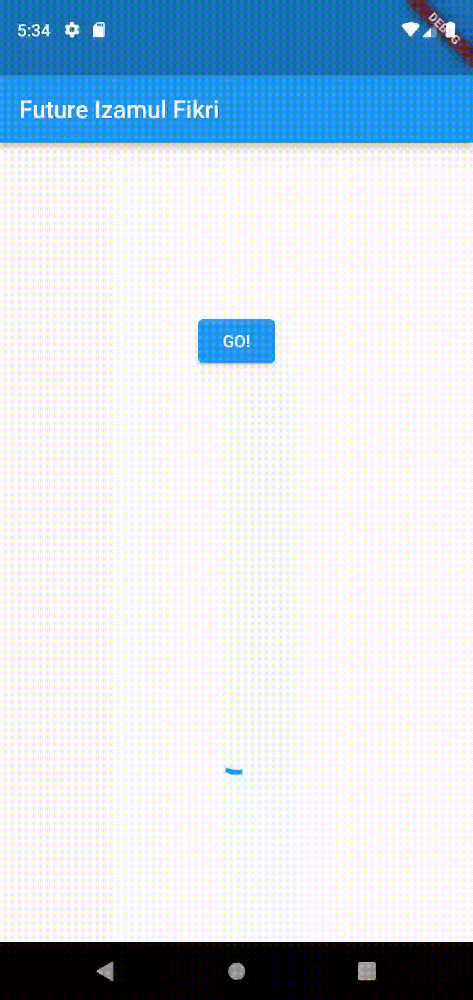

### Langkah 4: Ganti variabel futureGroup

Anda dapat menggunakan FutureGroup dengan Future.wait seperti kode berikut.

```dart
final futures = Future.wait<int>([
  returnOneAsync(),
  returnTwoAsync(),
  returnThreeAsync(),
]);
```

menjadi

```dart
  void returnFG() {
    // FutureGroup<int> futureGroup = FutureGroup<int>();
    // futureGroup.add(returnOneAsync());
    // futureGroup.add(returnTwoAsync());
    // futureGroup.add(returnThreeAsync());
    // futureGroup.close();
    final futures = Future.wait<int>([
      returnOneAsync(),
      returnTwoAsync(),
      returnThreeAsync(),
    ]);
    futures.then((List<int> value) {
      int total = 0;
      for (var element in value) {
        total += element;
      }
      setState(() {
        result = total.toString();
      });
    });
  }
```

<aside style="color:white; background-color:green;"><h3 is-upgraded=""><strong>Soal 8</strong></h3>
<ul>
<li>Jelaskan maksud perbedaan kode langkah 1 dan 4!
</li>
</ul>
</aside>

### Jawab Soal 8

            angkah 1 dan Langkah 4 mencapai hasil yang sama, yaitu menggabungkan beberapa future menjadi satu dan menunggu hingga semuanya selesai sebelum melanjutkan. Namun, ada perbedaan pendekatan di antara keduanya.

            Langkah 1 menggunakan pustaka async yang menyediakan FutureGroup untuk mengelola sekelompok future. Dalam method returnFG(), Anda menambahkan future ke FutureGroup, menutupnya, dan kemudian menunggu hasilnya menggunakan futureGroup.future. Ini memungkinkan Anda untuk menangani hasilnya dengan logika khusus dan melakukan iterasi pada nilai-nilai tersebut sebelum mengupdate UI.

            Di sisi lain, Langkah 4 menggunakan Future.wait langsung untuk menggabungkan future menjadi satu future tunggal. Pendekatan ini lebih langsung dan mudah dibaca. Dalam kasus ini, Anda tidak perlu membungkusnya dengan FutureGroup dan dapat menangani hasilnya langsung setelah Future.wait selesai.

            Pilihan antara Langkah 1 dan Langkah 4 dapat bergantung pada kebutuhan spesifik dan kompleksitas logika yang ingin Anda terapkan pada hasil future tersebut.

<hr>

## Praktikum 5: Menangani Respon Error pada Async Code

Ada beberapa teknik untuk melakukan handle error pada code async. Pada praktikum ini Anda akan menggunakan 2 cara, yaitu then() callback dan pola async/await.

Setelah Anda menyelesaikan praktikum 4, Anda dapat melanjutkan praktikum 5 ini. Selesaikan langkah-langkah praktikum berikut ini menggunakan editor Visual Studio Code (VS Code) atau Android Studio atau code editor lain kesukaan Anda. Jawablah di laporan praktikum Anda pada setiap soal yang ada di beberapa langkah praktikum ini.

    Perhatian: Diasumsikan Anda telah berhasil menyelesaikan Praktikum 4.

### Langkah 1: Buka file main.dart

Tambahkan method ini ke dalam class \_FuturePageState

```dart
Future returnError() async {
    await Future.delayed(const Duration(seconds: 2));
    throw Exception('Something Terrible Happened!');
}
```

### Langkah 2: ElevatedButton

Ganti dengan kode berikut

```dart
returnError(
    .then((value){
        setState((){
            result = 'Success';
        });
    }).catchError((onError){
        setState((){
            result = onError.toString();
        });
    }).whenComplete(() => print('Complete'));
)
```

### Langkah 3: Run

Lakukan run dan klik tombol GO! maka akan menghasilkan seperti gambar berikut.

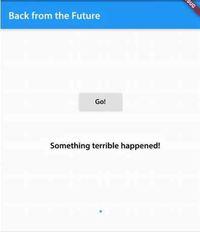

Pada bagian debug console akan melihat teks Complete seperti berikut.

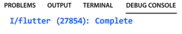

<aside style="color:white; background-color:green;"><h3 is-upgraded=""><strong>Soal 9</strong></h3>
<ul>
<li>Capture hasil praktikum Anda berupa GIF dan lampirkan di README. Lalu lakukan commit dengan pesan "W12: Soal 9".
</li>
</ul>
</aside>

### Jawab Soal 9

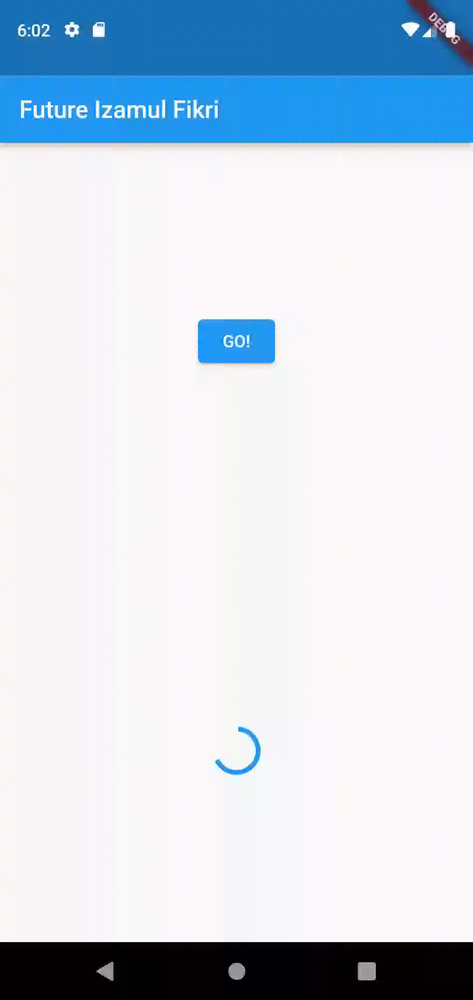

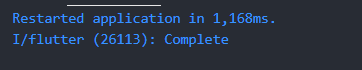

### Langkah 4: Tambah method handleError()

Tambahkan kode ini di dalam class \_FutureStatePage

```dart
Future handleError() async {
    try{
        await returnError();
    }catch(error){
        setState((){
            result = error.toString();
        });
    }finally{
        print('Complete');
    }
}
```

<aside style="color:white; background-color:green;"><h3 is-upgraded=""><strong>Soal 10</strong></h3>
<ul>
<li>Panggil method handleError() tersebut di ElevatedButton, lalu run. Apa hasilnya? Jelaskan perbedaan kode langkah 1 dan 4!
</li>
</ul>
</aside>

### Jawab Soal 10

Untuk memenuhi kebutuhan tersebut maka ElevatedButton akan menjadi:

```dart
          ElevatedButton(
            child: const Text('GO!'),
            onPressed: () {
              handleError();
              // returnError().then((value) {
              //   setState(() {
              //     result = 'Success';
              //   });
              // }).catchError((onError) {
              //   setState(() {
              //     result = onError.toString();
              //   });
              //   // ignore: avoid_print
              // }).whenComplete(() => print('Complete'));
              // returnFG();
              // getNumber().then((value) {
              //   setState(() {
              //     result = value.toString();
              //   });
              // }).catchError((e) {
              //   result = 'An error occurred';
              // });
              // count();
              // // setState(() {});
              // // getData().then((value) {
              // //   result = value.body.toString().substring(0, 450);
              // //   setState(() {});
              // // }).catchError((_) {
              // //   result = "An error occurred";
              // //   setState(() {});
              // // });
            },
          ),
```

dan hasilnya adalah


            Langkah 1 menambahkan metode `returnError()` langsung ke dalam kelas `_FuturePageState`. Metode ini menggunakan `Future` untuk mengimplementasikan penundaan selama 2 detik dan kemudian melempar pengecualian dengan pesan "Something Terrible Happened!".

            Sementara itu, Langkah 4 menambahkan metode `handleError()` di dalam kelas `_FuturePageState`. Metode ini menggunakan blok `try-catch` untuk menangkap kesalahan yang dihasilkan oleh metode `returnError()` dan menetapkannya ke dalam variabel `result`. Blok `finally` juga digunakan untuk mencetak "Complete" ke konsol setelah penanganan kesalahan selesai.

            Dengan kata lain, kedua langkah ini bersama-sama menunjukkan cara menangani kesalahan yang mungkin terjadi dalam pemrograman asinkron di Flutter, dan perbedaan utamanya terletak pada penempatan metode dan nama metodenya.

<hr>

## Praktikum 6: Menggunakan Future dengan StatefulWidget

Seperti yang Anda telah pelajari, Stateless widget tidak dapat menyimpan informasi (state), StatefulWidget dapat mengelola variabel dan properti dengan method setState(), yang kemudian dapat ditampilkan pada UI. State adalah informasi yang dapat berubah selama life cycle widget itu berlangsung.

Ada 4 method utama dalam life cycle StatefullWidget:

- initState(): dipanggil sekali ketika state dibangun. Bisa dikatakan ini juga sebagai konstruktor class.

- build(): dipanggil setiap kali ada perubahan state atau UI. Method ini melakukan destroy UI dan membangun ulang dari nol.

- deactive() dan dispose(): digunakan untuk menghapus widget dari tree, pada beberapa kasus dimanfaatkan untuk menutup koneksi ke database atau menyimpan data sebelum berpindah screen.

Setelah Anda menyelesaikan praktikum 5, Anda dapat melanjutkan praktikum 6 ini. Selesaikan langkah-langkah praktikum berikut ini menggunakan editor Visual Studio Code (VS Code) atau Android Studio atau code editor lain kesukaan Anda. Jawablah di laporan praktikum Anda pada setiap soal yang ada di beberapa langkah praktikum ini.

        Perhatian: Diasumsikan Anda telah berhasil menyelesaikan Praktikum 5.

### Langkah 1: install plugin geolocator

Tambahkan plugin geolocator dengan mengetik perintah berikut di terminal.

```dart
flutter pub add geolocator
```

### Langkah 2: Tambah permission GPS

Jika Anda menargetkan untuk platform Android, maka tambahkan baris kode berikut di file android/app/src/main/androidmanifest.xml

```dart
<uses-permission android:name="android.permission.ACCESS_FINE_LOCATION"/>
<uses-permission android:name="android.permission.ACCESS_COARSE_LOCATION"/>
```

Jika Anda menargetkan untuk platform iOS, maka tambahkan kode ini ke file Info.plist

```dart
<key>NSLocationWhenInUseUsageDescription</key>
<string>This app needs to access your location</string>
```

### Langkah 3: Buat file geolocation.dart

Tambahkan file baru ini di folder lib project Anda.

### Langkah 4: Buat StatefulWidget

Buat class LocationScreen di dalam file geolocation.dart

### Langkah 5: Isi kode geolocation.dart

```dart
import 'package:flutter/material.dart';
import 'package:geolocator/geolocator.dart';

class LocationScreen extends StatefulWidget {
    const LocationScreen({super.key});

    @override
    state<LocationScreen> createState() => _LocationScreenState();
}

class _LocationScreenState extends State<LocationScreen> {
    String myPosition = '';
    @override
    void iniState() {
        super.initState();
        getPosition().then((Position myPos){
            myPosition =
            'Latitude: ${myPos.latitude.toString()} - Longitude: {myPos.longitude.toString()}';
            setState((){
                myPosition = myPosition;
            });
        });
    }


@override
Widget build(BuildContext context){
    return Scaffold(
        appBar: AppBar(title: const Text('Current Location')),
        body: Center(child: Text(myPosition)),
    );
}

Future<Position> getPosition() async{
    await Geolocator.requestPermission();
    await GeoLocator.isLocationServicesEnabled();
    Position? position = await Geolocator.getCurrentPosition();
    return position;
}

}
```

<aside style="color:white; background-color:green;"><h3 is-upgraded=""><strong>Soal 11</strong></h3>
<ul>
<li>Tambahkan nama panggilan Anda pada tiap properti title sebagai identitas pekerjaan Anda.
</li>
</ul>
</aside>

### Jawab Soal 11

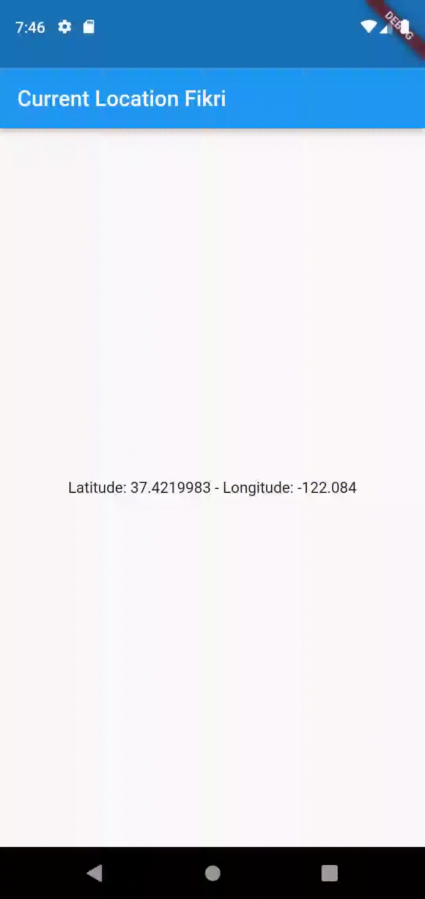

### Langkah 6: Edit main.dart

Panggil screen baru tersebut di file main Anda seperti berikut.

```dart
home: LocationScreen(),
```

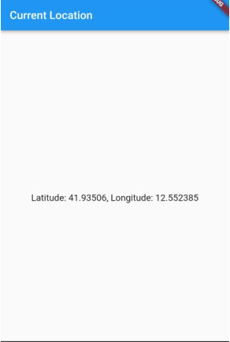

### Langkah 7: Run

Run project Anda di device atau emulator (bukan browser), maka akan tampil seperti berikut ini.

### Langkah 8: Tambahkan animasi loading

Tambahkan widget loading seperti kode berikut. Lalu hot restart, perhatikan perubahannya.

```dart
@override
Widget build(BuildContext context){
    final myWidget = myPosition == '' ? const CircularProgressIndicator() : const Text(myPosition);

    return Scaffold(
        appBar: AppBar(title: Text('Current Location')),
        body: Center(child:myWidget),
    )
}
```

    <aside style="color:white; background-color:green;"><h3 is-upgraded=""><strong>Soal 12</strong></h3>
    <ul>
    <li>Jika Anda tidak melihat animasi loading tampil, kemungkinan itu berjalan sangat cepat. Tambahkan delay pada method getPosition() dengan kode await Future.delayed(const Duration(seconds: 3));
    </li>
    <li>Apakah Anda mendapatkan koordinat GPS ketika run di browser? Mengapa demikian?
    </li>
    <li>Capture hasil praktikum Anda berupa GIF dan lampirkan di README. Lalu lakukan commit dengan pesan "W12: Soal 12".
    </li>
    </ul>
    </aside>

### Jawab Soal 12

Setelah ditambah kode untuk menambah delay 3 detik

```dart
  Future<Position> getPosition() async {
    await Geolocator.requestPermission();
    await Geolocator.isLocationServiceEnabled();

    // Tambahkan penundaan selama 3 detik di sini
    await Future.delayed(const Duration(seconds: 3));

    Position? position = await Geolocator.getCurrentPosition();
    return position;
  }
```


Dan ketika dicoba dichrome

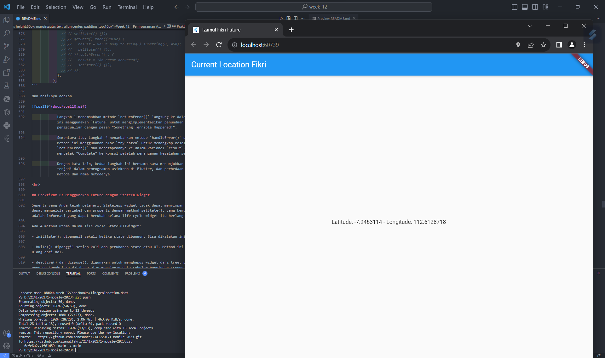

        Akses lokasi dapat digunakan pada perangkat Flutter yang menjalankan di Chrome karena Chrome mendukung API geolokasi HTML5 yang dapat diakses oleh aplikasi Flutter melalui plugin Geolocator.


<hr>

## Praktikum 7: Manajemen Future dengan FutureBuilder

Pola ketika menerima beberapa data secara async dan melakukan update pada UI sebenarnya itu tergantung pada ketersediaan data. Secara umum fakta di Flutter, ada sebuah widget yang membantu Anda untuk memudahkan manajemen future yaitu widget FutureBuilder.

Anda dapat menggunakan FutureBuilder untuk manajemen future bersamaan dengan update UI ketika ada update Future. FutureBuilder memiliki status future sendiri, sehingga Anda dapat mengabaikan penggunaan setState, Flutter akan membangun ulang bagian UI ketika update itu dibutuhkan.

Untuk lebih memahami widget FutureBuilder, mari kita coba dengan praktikum ini.

Setelah Anda menyelesaikan praktikum 6, Anda dapat melanjutkan praktikum 7 ini. Selesaikan langkah-langkah praktikum berikut ini menggunakan editor Visual Studio Code (VS Code) atau Android Studio atau code editor lain kesukaan Anda. Jawablah di laporan praktikum Anda pada setiap soal yang ada di beberapa langkah praktikum ini.

        Perhatian: Diasumsikan Anda telah berhasil menyelesaikan Praktikum 6.

### Langkah 1: Modifikasi method getPosition()

Buka file geolocation.dart kemudian ganti isi method dengan kode ini.

```dart
Future<Position> getPosition() async {
    await Geolocator.isLocationServiceEnabled();
    await Future.delayed(const Duration(second: 3));
    Position position = await Geolocator.getCurrentPosition();
    return position;
}
```

### Langkah 3: Tambah initState()

Tambah method ini dan set variabel position

```dart
@override
void initState(){
    super.initState();
    position = getPosition();
}
```

### Langkah 4: Edit method build()

Ketik kode berikut dan sesuaikan. Kode lama bisa Anda comment atau hapus.

```dart
@override
Widget build(BuildContext context){
    return Scaffold(
        appBar: AppBar(title: Text('Current Location')),
        body: Center(child: FutureBuilder(
            future: position,
            builder: (BuildContext context, AsyncSnapshot<Position> snapshot){
                if (snapshot.connectionState == ConnectionState.waiting){
                    return const CircularProgressIndicator();
                }else if(snapshot.connectionState == ConnectionState.done){
                    return Text(snapshot.data.toString());
                }else{
                    return const Text('');
                }
            },
        ),
        ));
}
```

<aside style="color:white; background-color:green;"><h3 is-upgraded=""><strong>Soal 13</strong></h3>
<ul>
<li>Apakah ada perbedaan UI dengan praktikum sebelumnya? Mengapa demikian?
</li>
<li>Capture hasil praktikum Anda berupa GIF dan lampirkan di README. Lalu lakukan commit dengan pesan "W12: Soal 13".
</li>
<li>Seperti yang Anda lihat, menggunakan FutureBuilder lebih efisien, clean, dan reactive dengan Future bersama UI.
</li>
</ul>
</aside>

### Jawab Soal 13

        Dalam langkah-langkah ini, perubahan signifikan terjadi pada implementasi UI. Sebelumnya, data lokasi ditampilkan secara langsung di widget Text pada method build(). Namun, dalam praktikum ini, menggunakan FutureBuilder untuk menangani proses asynchronous dari getPosition(). Hal ini memberikan tampilan yang lebih responsif dengan menampilkan indikator loading (CircularProgressIndicator) selama proses pengambilan lokasi sedang berlangsung. Setelah proses selesai, data lokasi akan ditampilkan, memberikan penggunaan yang lebih baik dan lebih responsif.


### Langkah 5: Tambah handling error

Tambahkan kode berikut untuk menangani ketika terjadi error. Kemudian hot restart.

```dart
else if (snapshot.connectionState == ConnectionState.done) {
  if (snapshot.hasError) {
     return Text('Something terrible happened!');
  }
  return Text(snapshot.data.toString());
}
```

<aside style="color:white; background-color:green;"><h3 is-upgraded=""><strong>Soal 14</strong></h3>
<ul>
<li>Apakah ada perbedaan UI dengan langkah sebelumnya? Mengapa demikian?
</li>
<li>Capture hasil praktikum Anda berupa GIF dan lampirkan di README. Lalu lakukan commit dengan pesan "W12: Soal 14".
</li>
</ul>
</aside>

         ada perbedaan dalam UI setelah menambahkan handling error menggunakan kode di atas. Sebelumnya, jika terjadi kesalahan dalam pengambilan lokasi, UI hanya menampilkan teks kosong (Text('')). Setelah menambahkan handling error, jika terjadi kesalahan (snapshot.hasError), UI akan menampilkan pesan yang memberitahu pengguna bahwa "Something terrible happened!" di tempat teks kosong. Ini memberikan informasi yang lebih jelas kepada pengguna tentang kegagalan proses pengambilan lokasi dan meningkatkan pengalaman pengguna secara keseluruhan.

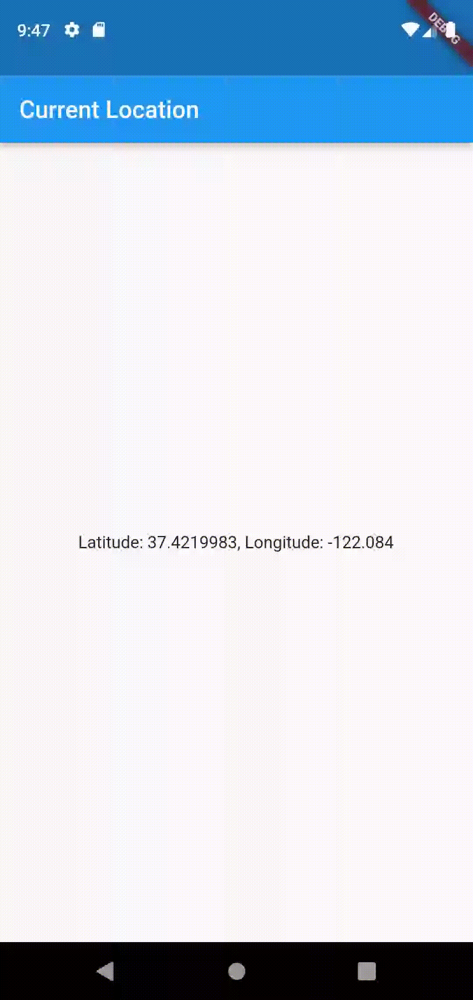

## Praktikum 8: Navigation route dengan Future Function

Praktikum kali ini Anda akan melihat manfaat Future untuk Navigator dalam transformasi Route menjadi sebuah function async. Anda akan melakukan push screen baru dan fungsi await menunggu data untuk melakukan update warna background pada screen.

Setelah Anda menyelesaikan praktikum 7, Anda dapat melanjutkan praktikum 8 ini. Selesaikan langkah-langkah praktikum berikut ini menggunakan editor Visual Studio Code (VS Code) atau Android Studio atau code editor lain kesukaan Anda. Jawablah di laporan praktikum Anda pada setiap soal yang ada di beberapa langkah praktikum ini.

        Perhatian: Diasumsikan Anda telah berhasil menyelesaikan Praktikum 7.

### Langkah 1: Buat file baru navigation_first.dart

Buatlah file baru ini di project lib Anda.

### Langkah 2: Isi kode navigation_first.dart

```dart
import 'package:flutter/material.dart';

class NavigationFirst extends StatefulWidget {
    const NavigationFirst({super.key});

    @override
    State<NavigationFirst> createState() => _NavigationFirstState();
}

class _NavigationFirstState extends State<NavigationFirst> {
    Color color = Colors.blue.shade700;
    @override
    Widget build(BuildContext context){
        return Scaffold(
            backgroundColor: color,
            appBar: AppBar(
                title: const Text('Navigation First Screen'),
            ),
            body: Center(
                child: ElevatedButton(
                    child: const Text('Change Color'),
                    onPressed: () {
                        _navigateAndGetColor(context);
                    }
                ),
            ),
        );
    }
}
```

<aside style="color:white; background-color:green;"><h3 is-upgraded=""><strong>Soal 15</strong></h3>
<ul>
<li>Tambahkan nama panggilan Anda pada tiap properti title sebagai identitas pekerjaan Anda.
</li>
<li>Silakan ganti dengan warna tema favorit Anda.
</li>
</ul>
</aside>

### Jawab Soal 15

```dart
class _NavigationFirstState extends State<NavigationFirst> {
    Color color = Colors.yellow.shade700;
    @override
    Widget build(BuildContext context){
        return Scaffold(
            backgroundColor: color,
            appBar: AppBar(
                title: const Text('Navigation First Screen Fikri Izamul'),
            ),
            body: Center(
                child: ElevatedButton(
                    child: const Text('Change Color'),
                    onPressed: () {
                        _navigateAndGetColor(context);
                    }
                ),
            ),
        );
    }
}
```

### Langkah 3: Tambah method di class _NavigationFirstState

Tambahkan method ini.

```dart
Future _navigateAndGetColor(BuildContext context) async {
   color = await Navigator.push(context,
        MaterialPageRoute(builder: (context) => const NavigationSecond()),) ?? Colors.blue;
   setState(() {});
   });
}   
```

### Langkah 4: Buat file baru navigation_second.dart

Buat file baru ini di project lib Anda. Silakan jika ingin mengelompokkan view menjadi satu folder dan sesuaikan impor yang dibutuhkan.


### Langkah 5: Buat class NavigationSecond dengan StatefulWidget

```dart
import 'package:flutter/material.dart';

class NavigationSecond extends StatefulWidget {
    const NavigationSecond({super.key});

    @override
    State<NavigationSecond> createState() => _NavigationSecondState();
}

class _NavigationSecondState extends State<NavigationSecond> {
    @override
    Widget build(BuildContext context){
        Color color;
        return Scaffold(
            appBar: AppBar(
                title: const Text('Navigation Second Screen'),
            ),
            body: Center(
                child: Column(
                    mainAxisAlignment: MainAxisAlignment.spaceEvenly,
                    children: [
                        ElevatedButton(
                            child: const Text('Red'),
                            onPressed: () {
                                color = Color.red.shade700;
                                Navigator.pop(context, color);
                            }
                        ),
                        ElevatedButton(
                            child: const Text('Yellow'),
                            onPressed: () {
                                color = Color.yellow.shade700;
                                Navigator.pop(context, color);
                            }
                        ),
                        ElevatedButton(
                            child: const Text('Blue'),
                            onPressed: () {
                                color = Color.blue.shade700;
                                Navigator.pop(context, color);
                            }
                        ),
                    ]
                )
            ),
        );
    }
}
```


### Langkah 6: Edit main.dart

Lakukan edit properti home.

```dart
home: const NavigationFirst(),
```

### Langkah 7: Run

Lakukan run, jika terjadi error silakan diperbaiki.


<aside style="color:white; background-color:green;"><h3 is-upgraded=""><strong>Soal 16</strong></h3>
<ul>
<li>Cobalah klik setiap button, apa yang terjadi ? Mengapa demikian ?
</li>
<li>Gantilah 3 warna pada langkah 5 dengan warna favorit Anda!
</li>
<li>Capture hasil praktikum Anda berupa GIF dan lampirkan di README. Lalu lakukan commit dengan pesan "W12: Soal 16".
</li>
</ul>
</aside>

Hasilnya akan seperti gambar berikut ini.


## Praktikum 9: Memanfaatkan async/await dengan Widget Dialog

Pada praktikum ini, Anda akan memanfaatkan widget AlertDialog. Anda bisa manfaatkan widget ini misal untuk memilih operasi Save, Delete, Accept, dan sebagainya.

Setelah Anda menyelesaikan praktikum 8, Anda dapat melanjutkan praktikum 9 ini. Selesaikan langkah-langkah praktikum berikut ini menggunakan editor Visual Studio Code (VS Code) atau Android Studio atau code editor lain kesukaan Anda. Jawablah di laporan praktikum Anda pada setiap soal yang ada di beberapa langkah praktikum ini.

        Perhatian: Diasumsikan Anda telah berhasil menyelesaikan Praktikum 8.

### Langkah 1: Buat file baru navigation_dialog.dart
