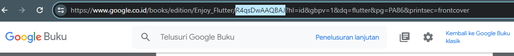

# <div style="color:white; background-color:green; height:50px; margin:auto; text-align:center; padding-top:10px">Week 12 - Pemrograman Asynchronous</div>

## Authors

- [@izamulfikri](https://www.github.com/zenosance)

<hr>

## Praktikum 1: Mengunduh Data dari Web Service (API)

Selesaikan langkah-langkah praktikum berikut ini menggunakan editor Visual Studio Code (VS Code) atau Android Studio atau code editor lain kesukaan Anda. Jawablah di laporan praktikum Anda pada setiap soal yang ada di beberapa langkah praktikum ini.

        Perhatian: Diasumsikan Anda telah berhasil melakukan setup environment Flutter SDK, VS Code, Flutter Plugin, dan Android SDK pada pertemuan pertama.

### Langkah 1: Buat Project Baru

Buatlah sebuah project flutter baru dengan nama books di folder src week-12 repository GitHub Anda.

Kemudian Tambahkan dependensi http dengan mengetik perintah berikut di terminal.

```dart
flutter pub add http
```

### Langkah 2: Cek file pubspec.yaml

Jika berhasil install plugin, pastikan plugin http telah ada di file pubspec ini seperti berikut.

```dart
dependencies:
  flutter:
    sdk: flutter
  http: ^1.1.0
```

Jika Anda menggunakan macOS, Anda harus mengaktifkan fitur networking pada file macos/Runner/DebugProfile.entitlements dan macos/Runner/Release.entitlements dengan menambahkan kode berikut:


### Langkah 3: Buka file main.dart

Ketiklah kode seperti berikut ini.

<aside style="color:white; background-color:green;"><h3 is-upgraded=""><strong>Soal 1</strong></h3>Tambahkan nama panggilan Anda pada title app sebagai identitas hasil pekerjaan Anda.
</aside>

<br>


        Catatan:

        Tidak ada yang spesial dengan kode di main.dart tersebut. Perlu diperhatikan di kode tersebut terdapat widget CircularProgressIndicator yang akan menampilkan animasi berputar secara terus-menerus, itu pertanda bagus bahwa aplikasi Anda responsif (tidak freeze/lag). Ketika animasi terlihat berhenti, itu berarti UI menunggu proses lain sampai selesai.

### Jawab Soal 1


### Langkah 4: Tambah method getData()

Tambahkan method ini ke dalam class _FuturePageState yang berguna untuk mengambil data dari API Google Books.


<aside style="color:white; background-color:green;"><h3 is-upgraded=""><strong>Soal 2</strong></h3>
<ul>
<li>Carilah judul buku favorit Anda di Google Books, lalu ganti ID buku pada variabel <code>path</code> di kode tersebut. Caranya ambil di URL browser Anda seperti gambar berikut ini.<br>
<p class="image-container"></p>
</li>
</ul>
<ul>
<li>Kemudian cobalah akses di browser URI tersebut dengan lengkap seperti ini. Jika menampilkan data JSON, maka Anda telah berhasil. Lakukan <em>capture </em>milik Anda dan tulis di <code>README</code> pada laporan praktikum. Lalu lakukan commit dengan pesan "<strong>W12: Soal 2</strong>".<br>
<p class="image-container"></p>
</li>
</ul>
</aside>

### Jawab Soal 2


### Langkah 5: Tambah kode di ElevatedButton

Tambahkan kode pada onPressed di ElevatedButton seperti berikut.


Lakukan run aplikasi Flutter Anda. Anda akan melihat tampilan akhir seperti gambar berikut. Jika masih terdapat error, silakan diperbaiki hingga bisa running.

<aside style="color:white; background-color:green;"><h3 is-upgraded=""><strong>Soal 3</strong></h3>
<ul>
<li>Jelaskan maksud kode langkah 5 tersebut terkait substring dan catchError!
</li>
<li>Capture hasil praktikum Anda berupa GIF dan lampirkan di README. Lalu lakukan commit dengan pesan "W12: Soal 3".</li>
</ul>
</aside>

