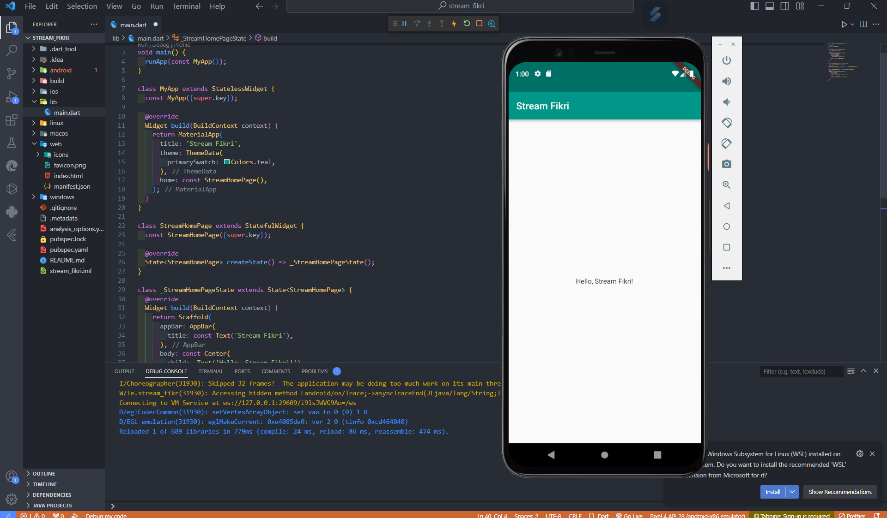
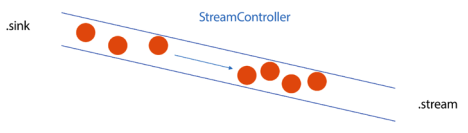
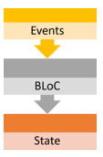

# <div style="color:white; background-color:green; height:50px; margin:auto; text-align:center; padding-top:10px">Week 13 -  Lanjutan State Management dengan Streams</div>

## Authors

- [@izamulfikri](https://www.github.com/zenosance)

<hr>

## Praktikum 1: Dart Streams

Selesaikan langkah-langkah praktikum berikut ini menggunakan editor Visual Studio Code (VS Code) atau Android Studio atau code editor lain kesukaan Anda. Jawablah di laporan praktikum Anda pada setiap soal yang ada di beberapa langkah praktikum ini.

        Perhatian: Diasumsikan Anda telah berhasil melakukan setup environment Flutter SDK, VS Code, Flutter Plugin, dan Android SDK pada pertemuan pertama.

### Langkah 1: Buat Project Baru

Buatlah sebuah project flutter baru dengan nama `stream_nama` (beri nama panggilan Anda) di folder `week-13/src/` repository GitHub Anda.

### Langkah 2: Buka file main.dart

Ketiklah kode seperti berikut ini.

```dart
import 'package: flutter/material.dart';

void main() {
  runApp(const myApp());
}

class MyApp extends StatelessWidget {
  const MyApp({super.key});

  @override
  Widhet build(BuildContext context) {
  return MaterialApp(
    title: 'Stream',
    theme: ThemeData(
      primarySwatch: Color.deepPurple,
    ),
    home: const StreamHomePage(),
  );
  }
}


class StreamHomePage extends StatelessWidget {
  const StreamHomePage({super.key});

  @override
  State<StreamHomePage> createState() => _StreamHomePageState();
}

class _StreamHomePageState extends State<StreamHopePage>{
  @override
  Widget build(BuildContext context) {
    return Container();
  }
}
```
> soal 1
> - Tambahkan nama panggilan Anda pada title app sebagai identitas hasil pekerjaan Anda.
> - Gantilah warna tema aplikasi sesuai kesukaan Anda.
> - Lakukan commit hasil jawaban Soal 1 dengan pesan "W13: Jawaban Soal 1".


### Jawaban soal 1




### Langkah 3: Buat file baru stream.dart

Tambahkan variabel di dalam class ColorStream seperti berikut.

```dart
import 'package:flutter/material.dart';

class ColorStream {

}
```

### Langkah 4: Tambah variabel colors

Tambahkan variabel di dalam class ColorStream seperti berikut.

```dart
final List<Color> colors = [
  Colors.blueGrey,
  Color.amber,
  COlors.deepPurple,
  Colors.lightBlue,
  Colors.teal
  ];
```

> Soal 2
> - Tambahkan 5 warna lainnya sesuai keinginan Anda pada variabel colors tersebut
> - Lakukan commist hasil jawaban Soal 2 dengan pesan "W13: Jawaban Soal 2"


### Langkah 5: Tambah method getColors()

Di dalam class `ColorStream` ketik method seperti kode berikut. Perhatikan tanda bintang di akhir keyword `async*` (ini digunakan untuk melakukan `Stream` data)

```dart
Stream<Color> getColors() async*{

}
```

### Langkah 6: Tambah perintah yield*

Tambahkan kode berikut ini.

```dart
yield* Stream.periodic(
  const Duration(seconds: 1), (int t) {
    int index = t % colors.length;
    return colors[index];
});
```

> Soal 3
> - Jelaskan fungsi keyword yeild* pada kode tersebut!
> - Apa maksud isi perintah kode tersebut?
> - Lakukan commit hasil jawaban Soal 3 dengan pesan "W13: Jawaban Soal 3"

### Langkah 7: Buka main.dart

Ketik kode impor file ini pada file main.dart

```dart
import 'stream.dart';
```

### Langkah 8: Tambah variabel

Ketik dua properti ini di dalam class `_StreamHomePageState`

```dart
import 'stream.dart';
```

### Langkah 9: Tambah method changeColor()

Tetap di file main, Ketik kode seperti berikut

```dart
import 'stream.dart';
```

### Langkah 10: Lakukan override initState()

Ketika kode seperti berikut

```dart
@override
void iniState(){
  super.initState();
  colorStream = ColorStream();
  changeColor();
}
```

### Langkah 11: Ubah isi Scaffold()

Sesuaikan kode seperti berikut.

```dart
return Scaffold(
  appBar: AppBar(
    title: const Text('Stream'),
  ),
  body: Container(
    decoration: BoxDecoration(color: bgColor),
  )
);
```

### Langkah 12: Run

Lakukan running pada aplikasi Flutter Anda, maka akan terlihat berubah warna background setiap detik.

> Soal 4
> - Capture hasil praktikum Anda berupa GIF dan lampirkan di README.
> - Lakukan commit hasil jawaban Soal 4 dengan pesan "W13: Jawaban Soal 4"

### Langkah 13: Ganti isi method changeColor()

Anda boleh comment atau hapus kode sebelumnya, lalu ketika kode seperti berikut.

```dart
colorStream.getColors().listen((eventColor) {
  setState((){
      bgColor = eventColor;
  });
});
```

> Soal 5
> - Jelaskan perbedaan menggunakan listen dan await for (langkah 9) !
> - Lakukan commit hasil jawaban Soal 5 dengan pesan "W13: Jawaban Soal 5"


> Catatan: Stream di Flutter memiliki fitur yang powerfull untuk menangani data secara async. Stream dapat dimanfaatkan pada skenario dunia nyata seperti real-time messaging, unggah dan unduh file, tracking lokasi user, bekerja dengan data sensor IoT, dan lain sebagainya.

<hr>


## Praktikum 2: Stream controllers dan sinks

StreamControllers akan membuat jembatan antara Stream dan Sink. Stream berisi data secara sekuensial yang dapat diterima oleh subscriber manapun, sedangkan Sink digunakan untuk mengisi (injeksi) data.

Secara sederhana, StreamControllers merupakan stream management. Ia akan otomatis membuat stream dan sink serta beberapa method untuk melakukan kontrol terhadap event dan fitur-fitur yang ada di dalamnya.

Anda dapat membayangkan stream sebagai pipa air yang mengalir searah, dari salah satu ujung Anda dapat mengisi data dan dari ujung lain data itu keluar. Anda dapat melihat konsep stream pada gambar diagram berikut ini.



Di Flutter, Anda dapat menggunakan StreamController untuk mengontrol aliran data stream. Sebuah StreamController memiliki sebuah properti bernama sink yang berguna untuk insert data. Sedangkan properti stream berguna untuk menerima atau keluarnya data dari StreamController tersebut.

Setelah Anda menyelesaikan praktikum 1, Anda dapat melanjutkan praktikum 2 ini. Selesaikan langkah-langkah praktikum berikut ini menggunakan editor Visual Studio Code (VS Code) atau Android Studio atau code editor lain kesukaan Anda. Jawablah di laporan praktikum Anda pada setiap soal yang ada di beberapa langkah praktikum ini.

Pada codelab ini, kita akan menambah kode dari aplikasi stream di praktikum sebelumnya.


### Langkah 1: Buka file stream.dart

Lakukan impor dengan mengetik kode ini.

```dart
import 'dart:async';
```

### Langkah 2: Tambah class NumberStream

Tetap di file stream.dart tambah class baru seperti berikut.

```dart
class NumberStream{

}
```

### Langkah 3: Tambah StreamController

Di dalam class NumberStream buatlah variabel seperti berikut.


```dart
final StreamController<int> controller = StraemController<int>();
```

### Langkah 4: Tambah method addNumberToSink

Tetap di class NumberStream buatlah method ini

```dart
void addNumberToSink(int newNumber){
  controller.sink.add(newNumber);
}
```

### Langkah 5: Tambah method close()

```dart
close() {
    controller.close();
}
```

### Langkah 6: Buka main.dart

Ketik kode import seperti berikut


```dart
import 'dart:async';
import 'dart:math';
```

### Langkah 7: Tambah variabel

Di dalam class _StreamHomePageState ketik variabel berikut

```dart
int lastNumber = 0;
late StreamController numberStreamController;
late NumberStream numberStream;
```

### Langkah 8: Edit initState()

```dart
@override
void initState() {
    numberStream = NumberStream();
    numberStreamController = numberStream.controller;
    Stream stream = numberStreamController.stream;
    stream.listen((event){
        setState((){
            lastNumber = event;
        });
    });
    super.initState();
}
```

### Langkah 9: Edit dispose()

```dart
@override
void dispopse () {
    numberStreamController.close();
    super.dispose();
}
```

### Langkah 10: Tambah method addRandomNumber()

```dart
void addRandomNumber() {
  Random random = Random();
  int myNum = random.nextInt(10);
  numberStream.addNumberToSink(myNum);
}
```

### Langkah 11: Edit method build()

```dart
boyd: SizedBox(
    width: double.infinity,
    child: Column(
        mainAxisAlignment: MainAxisAlignment.spaceEvenly,
        crossAxisAlignment: CrossAxisAlignment.center,
        children: [
            Text(lastNumber.toString()),
            ElevatedButton(
                onPressed: () => addrandomNumber(),
                child: Text('New Random Number'),
            )
        ].
    ),
)
```

### Langkah 12: Run

Lakukan running pada aplikasi Flutter Anda, maka akan terlihat seperti gambar berikut.


> Soal 6
> - Jelaskan maksud kode langkah 8 dan 10 tersebut!
> - Capture hasil praktikum Anda berupa GIF dan lampirkan di README.
> - Lalu lakukan commit dengan pesan "W13: Jawaban Soal 6".

### Langkah 13: Buka stream.dart

Tambahkan method berikut ini.

```dart
addError(){
    controller.sink.addError('error');
}
```

### Langkah 14: Buka main.dart

Tambahkan method onError di dalam class StreamHomePageState pada method listen di fungsi initState() seperti berikut ini.

```dart
stream.listen((event){
    setState((){
        lastNumber = event;
    });
    }).onError((error){
    setState(() {
        lastNumber = -1;
    });
});
```

### Langkah 15: Edit method addRandomNumber()

Lakukan comment pada dua baris kode berikut, lalu ketik kode seperti berikut ini.

```dart
void addRandomNumber(){
    Random random = random();
    // int myNum = random.nextInt(10);
    // numberStream.addNumberToSink(myNum);
    numberStream.addError();
}
```

> Soal 7
> - Jelaskan maksud kode langkah 13 sampai 15 tersebut!
> - Kembalikan kode seperti semula pada Langkah 15, comment addError() agar Anda dapat melanjutkan ke praktikum 3 berikutnya.
> - Lalu lakukan commit dengan pesan "W13: Jawaban Soal 7".

<hr>

## Praktikum 3: Injeksi data ke streams

Skenario yang umum dilakukan adalah melakukan manipulasi atau transformasi data stream sebelum sampai pada UI end user. Hal ini sangatlah berguna ketika Anda membutuhkan untuk filter data berdasarkan kondisi tertentu, melakukan validasi data, memodifikasinya, atau melakukan proses lain yang memicu beberapa output baru. Contohnya melakukan konversi angka ke string, membuat sebuah perhitungan, atau menghilangkan data yang berulang terus tampil.

Pada praktikum 3 ini, Anda akan menggunakan StreamTransformers ke dalam stream untuk melakukan map dan filter data.

Setelah Anda menyelesaikan praktikum 2, Anda dapat melanjutkan praktikum 3 ini. Selesaikan langkah-langkah praktikum berikut ini menggunakan editor Visual Studio Code (VS Code) atau Android Studio atau code editor lain kesukaan Anda. Jawablah di laporan praktikum Anda pada setiap soal yang ada di beberapa langkah praktikum ini.

### Langkah 1: Buka main.dart

Tambahkan variabel baru di dalam class _StreamHomePageState

```dart
late StreamTransformer transformer;
```

### Langkah 2: Tambahkan kode ini di initState

```dart
transformer = StreamTransformer<int, int>.fromHandlers(
    handleData: (value,sink){
        sink.add(value * 10);
    },
    handleError: (error,trace,sink){
        sink.Add(-1);
    },
    handleDone: (sink) => sink.close());
```

### Langkah 3: Tetap di initState

Lakukan edit seperti kode berikut.

```dart
stream.transform(transformer).listen((event){
    setState((){
        lastNumber = event;
    });
}).onError((error){
    setState((){
        lastNumber = -1;
    });
});
super.initState();
```

### Langkah 4: Run

Terakhir, run atau tekan F5 untuk melihat hasilnya jika memang belum running. Bisa juga lakukan hot restart jika aplikasi sudah running. Maka hasilnya akan seperti gambar berikut ini. Anda akan melihat tampilan angka dari 0 hingga 90.


> Soal 8
> - Jelaskan maksud kode langkah 1-3 tersebut!
> - Capture hasil praktikum Anda berupa GIF dan lampirkan di README.
> - Lalu lakukan commit dengan pesan "W13: Jawaban Soal 8".

<hr>

## Praktikum 4: Subscribe ke stream events

Dari praktikum sebelumnya, Anda telah menggunakan method listen mendapatkan nilai dari stream. Ini akan menghasilkan sebuah Subscription. Subscription berisi method yang dapat digunakan untuk melakukan listen pada suatu event dari stream secara terstruktur.

Pada praktikum 4 ini, kita akan gunakan Subscription untuk menangani event dan error dengan teknik praktik baik (best practice), dan menutup Subscription tersebut.

Setelah Anda menyelesaikan praktikum 3, Anda dapat melanjutkan praktikum 4 ini. Selesaikan langkah-langkah praktikum berikut ini menggunakan editor Visual Studio Code (VS Code) atau Android Studio atau code editor lain kesukaan Anda. Jawablah di laporan praktikum Anda pada setiap soal yang ada di beberapa langkah praktikum ini.

### Langkah 1: Tambah variabel

Tambahkan variabel berikut di class _StreamHomePageState

```dart
late StreamSubscription subsctiption;
```

### Langkah 2: Edit initState()

Edit kode seperti berikut ini.

```dart
@override
void initState() {
    numberStream = NumberStream();
    numberStreamController = NumberStream.controller;
    Stream stream = numberStreamController.stream;
    subscription = stream.listen((event){
        setState((){
            lastNumber = event;
        });
    });
    super.initState();
}
```

### Langkah 3: Tetap di initState()

Tambahkan kode berikut ini.

```dart
subscription.onError((error){
    setState((){
        lastNumber = -1;
    };)
});
```

### Langkah 4: Tambah properti onDone()

Tambahkan dibawahnya kode ini setelah onError

```dart
subscription.onDone((){
    print('OnDone was called');
})
```

### Langkah 5: Tambah method baru

Ketik method ini di dalam class _StreamHomePageState

```dart
void stopStream(){
    numberStreamController.close();
}
```

### Langkah 6: Pindah ke method dispose()

Jika method dispose() belum ada, Anda dapat mengetiknya dan dibuat override. Ketik kode ini didalamnya.

```dart
subscription.cancel();
```

### Langkah 7: Pindah ke method build()

Tambahkan button kedua dengan isi kode seperti berikut ini.

```dart
ElevatedButton(
    onPressed: () => stopStream(),
    child: const Text('Stop Subscription'),
)
```

### Langkah 8: Edit method addRandomNumber()

Edit kode seperti berikut ini.

```dart
void addRandomNumber(){
    Random random = Random();
    int myNum = random.nextInt(10);
    if (!numberStreamController.isClosed){
        numberStream.addNumberToSink(myNum);
    }else{
        setState((){
            lastNumber = -1;
        });
    }
}
```

### Langkah 9: Run

Anda akan melihat dua button seperti gambar berikut.


### Langkah 10: Tekan button ‘Stop Subscription'

Anda akan melihat pesan di Debug Console seperti berikut.

<hr>

## Praktikum 5: Multiple stream subscriptions

Secara default, stream hanya bisa digunakan untuk satu subscription. Jika Anda mencoba untuk melakukan subscription yang sama lebih dari satu, maka akan terjadi error. Untuk menangani hal itu, tersedia broadcast stream yang dapat digunakan untuk multiple subscriptions. Pada praktikum ini, Anda akan mencoba untuk melakukan multiple stream subscriptions.

Setelah Anda menyelesaikan praktikum 4, Anda dapat melanjutkan praktikum 5 ini. Selesaikan langkah-langkah praktikum berikut ini menggunakan editor Visual Studio Code (VS Code) atau Android Studio atau code editor lain kesukaan Anda. Jawablah di laporan praktikum Anda pada setiap soal yang ada di beberapa langkah praktikum ini.

### Langkah 1: Buka file main.dart

Ketik variabel berikut di class _StreamHomePageState

```dart
import 'dart:html';

late StreamSubscription subscription2;
String values = '';
```

### Langkah 2: Edit initState()

Ketik kode seperti berikut.

```dart
subscription = stream.listen((event){
  setState((){
    values += ' $event - ';
  });
});

subscription2 = stream.listen((event){
  setState((){
    values += ' $event - ';
  });
});
```

### Langkah 3: Run

Lakukan run maka akan tampil error seperti gambar berikut.


> Soal 10
> - Jelaskan mengapa error itu bisa terjadi ?


### Langkah 4: Set broadcast stream

Ketik kode seperti berikut di method initState()


```dart
void initState(){
  numberStream = NumberStream();
  numberStreamController = numberStream.controller;
  Stream stream = numberStreamController.stream.asBrodcastStream();
}
```

### Langkah 5: Edit method build()

Tambahkan text seperti berikut

```dart
child: Column(
          mainAxisAlignment: MainAxisAlignment.spaceEvenly,
          crossAxisAlignment: CrossAxisAlignment.center,
          children: [
            Text(values),
          ]
)
```

### Langkah 6: Run

Tekan button ‘New Random Number' beberapa kali, maka akan tampil teks angka terus bertambah sebanyak dua kali.


> Soal 11
> - Jelaskan mengapa hal itu bisa terjadi ?
> - Capture hasil praktikum Anda berupa GIF dan lampirkan di README.
> - Lalu lakukan commit dengan pesan "W13: Jawaban Soal 10,11".


<hr>

## Praktikum 6: StreamBuilder

StreamBuilder adalah sebuah widget untuk melakukan listen terhadap event dari stream. Ketika sebuah event terkirim, maka akan dibangun ulang semua turunannya. Seperti halnya widget FutureBuilder pada pertemuan pekan lalu, StreamBuilder berguna untuk membangun UI secara reaktif yang diperbarui setiap data baru tersedia.

Setelah Anda menyelesaikan praktikum 5, Anda dapat melanjutkan praktikum 6 ini. Selesaikan langkah-langkah praktikum berikut ini menggunakan editor Visual Studio Code (VS Code) atau Android Studio atau code editor lain kesukaan Anda. Jawablah di laporan praktikum Anda pada setiap soal yang ada di beberapa langkah praktikum ini.

### Langkah 1: Buat Project Baru

Buatlah sebuah project flutter baru dengan nama streambuilder_nama (beri nama panggilan Anda) di folder week-13/src/ repository GitHub Anda.

### Langkah 2: Buat file baru stream.dart

Ketik kode ini

```dart
class NumberStream{}
```

### Langkah 3: Tetap di file stream.dart

Ketik kode seperti berikut.

```dart
import 'dart:math';

class NumberStream{
  Stream<int> getNumbers() async* {
    yield* Stream.periodic(const Duration(seconds: 1), (int t){
      Random random = Random();
      int myNum = random.nextInt(10);
      return myNum;
    });
  }
}
```

### Langkah 4: Edit main.dart

Ketik kode seperti berikut ini.


```dart
import 'package:flutter/material.dart';
import 'stream.dart';
import 'dart:async';

void main(){
  runApp(const MyApp());
}

class MyApp extends StatelessWidget{
  const MyApp({super.key});

  @override
  Widget build(BuildContext context){
    return MaterialApp(
      title: 'Stream',
      theme: ThemeData(
        primarySwatch: Colors.deepPurple,
      ),
      home: const StreamHomePage(),
    );
  }
}

class StreamHomePage extends StatefulWidget{
  const StreamHomePage({super.key});

  @override
  State<StreamHomePage> createState() => _StreamHomePageState();
}

class _StreamHomePageState extends State<StreamHomePage>{
  @override
  Widget build(BuildContext context){
    return Scaffold(

      appBar: AppBar(
        title: const Text('Stream'),
      ),
      body: Container(
      ),
      );
  }
}
```

### Langkah 5: Tambah variabel

Di dalam class _StreamHomePageState, ketika variabel ini.

```dart
late Stream<int> numberStream;
```

### Langkah 6: Edit initState()

Ketik kode seperti berikut.

```dart
@override

void initState(){
  numberStream = NumberStream().getNumbers();
  super.initState();
}
```

### Langkah 7: Edit method build()

```dart
body: StreamBuilder(
  stream: numberStream,
  initialData: 0,
  builder: (context, snapshot){
    if(snapshot.hasError){
      print('Error!');
    }
    if(snapshot.hasData){
      return Center(
        child: Text(
          snapshot.data.toString(),
          style: const TextStyle(fontSize: 96),
    ));
    
    }else{
      return const SizedBox.shrink();
  }
  },
),
```

### Langkah 8: Run

Hasilnya, setiap detik akan tampil angka baru seperti berikut.


> Soal 12
> - Jelaskan maksud kode pada langkah 3 dan 7 !
> - Capture hasil praktikum Anda berupa GIF dan lampirkan di README.
> - Lalu lakukan commit dengan pesan "W13: Jawaban Soal 12".

<hr>

## Praktikum 7: BLoC Pattern

Ketika menggunakan pola BLoC, maka segalanya merupakan stream event. BLoC atau Business Logic Component adalah lapisan antara semua sumber data dan UI yang mengonsumsi data itu. Contohnya seperti sumber data dari HTTP layanan web servis atau JSON dari sebuah basis data.

Sebuah BLoC menerima stream data dari sumbernya, proses itu membutuhkan logika bisnis Anda, dan return stream data ke subscriber-nya. Perhatikan diagram pola kerja BLoC berikut ini.



Alasan utama menggunakan BLoC adalah memisahkan logika bisnis aplikasi dengan presentasi UI pada widget, terutama akan sangat berguna ketika aplikasi Anda mulai semakin kompleks dan membutuhkan akses state di berbagai tempat. Hal ini akan membuat semakin mudah dalam menggunakan kode Anda, pada beberapa bagian di aplikasi atau bahkan berbeda aplikasi. Selain itu, BLoC secara independen berdiri sendiri dengan UI, sehingga sangat mudah dilakukan isolasi dalam proses testing.

Pada praktikum codelab ini, Anda akan membuat aplikasi sederhana menggunakan BLoC, namun Anda dapat dengan mudah mengembangkannya untuk aplikasi yang lebih besar ruang lingkupnya.

Setelah Anda menyelesaikan praktikum 6, Anda dapat melanjutkan praktikum 7 ini. Selesaikan langkah-langkah praktikum berikut ini menggunakan editor Visual Studio Code (VS Code) atau Android Studio atau code editor lain kesukaan Anda. Jawablah di laporan praktikum Anda pada setiap soal yang ada di beberapa langkah praktikum ini.

### Langkah 1: Buat Project baru

Buatlah sebuah project flutter baru dengan nama bloc_random_nama (beri nama panggilan Anda) di folder week-13/src/ repository GitHub Anda. Lalu buat file baru di folder lib dengan nama random_bloc.dart

### Langkah 2: Isi kode random_bloc.dart

Ketik kode impor berikut ini.

```dart
import 'dart:async';
import 'dart:math';
```

### Langkah 3: Buat class RandomNumberBloc()

```dart
class RandomNumberBlock{}
```

### Langkah 4: Buat variabel StreamController

Di dalam class RandomNumberBloc() ketik variabel berikut ini

```dart
//StreamController for input events
final _generateRandomController = StreamController<void>();
//StreamController for output 
final _randomNumberController = StreamController<int>();
//Input Sink
Sink<void> get generateRandom => _generateRandomController.sink;
//Output Stream
Stream<int> get randomNumber => _randomNumberController.stream;
_secondsStreamController.sink;
```

### Langkah 5: Buat constructor

```dart
RandomNumberBloc(){
  _generateRandomController.stream.listen((_){
    final random = Random().nextInt(10);
    _randomNumberController.sink.add(random);
  });
}
```

### Langkah 6: Buat method dispose()

```dart
void dispose(){
  _generateRandomController.close();
  _randomNumberController.close();
}
```

### Langkah 7: Edit main.dart

```dart
class MyApp extends StatelessWidget{
  const MyApp({super.key});

  @override
  Widget build(BuildContext context){
    return MaterialApp(
      title: 'Flutter Demo',
      theme: ThemeData(
        primarySwatch: Colors.blue,
      ),
      home: const RandomScreen(),
    );
  }
}
```

### Langkah 8: Buat file baru random_screen.dart

Di dalam folder lib project Anda, buatlah file baru ini.

### Langkah 9: Lakukan impor material dan random_bloc.dart

Ketik kode ini di file baru random_screen.dart

```dart
import 'package:flutter/material.dart';
import 'random_bloc.dart';
```

### Langkah 10: Buat StatefulWidget RandomScreen

Buatlah di dalam file random_screen.dart


### Langkah 11: Buat variabel

Ketik kode ini di dalam class _RandomScreenState

```dart
final _bloc = RandomNumberBloc();
```

### Langkah 12: Buat method dispose()

Ketik kode ini di dalam class _StreamHomePageState

```dart
@override
void dispose(){
  _bloc.dispose();
  super.dispose();
}
```

### Langkah 13: Edit method build()

Ketik kode ini di dalam class _StreamHomePageState

```dart
@override
Widget build(BuildContext context){
  return Scaffold(
    appBar: AppBar(
      title: const Text('Random Number'),
    ),
    body: Center(
      child: StreamBuilder<int>(
        stream: _bloc.randomNumber,
        initialData: 0,
        builder: (context, snapshot){
          return Text(
            'Random Number: ${snapshot.data}',
            style: const TextStyle(fontSize: 24),
          );
        },
      ),
    ),
    floatingActionButton: FloatingActionButton(
      onPressed: () => _bloc.generateRandom.add(null),
      child: const Icon(Icons.refresh),
    ),
  );
},
```

Run aplikasi, maka Anda akan melihat angka acak antara angka 0 sampai 9 setiap kali menekan tombol FloactingActionButton.


> Soal 13
> - Jelaskan maksud praktikum ini ! Dimanakah letak konsep pola BLoC-nya ?
> - Capture hasil praktikum Anda berupa GIF dan lampirkan di README.
> - Lalu lakukan commit dengan pesan "W13: Jawaban Soal 13".