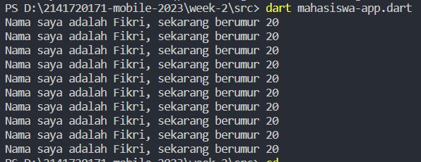

# Week 02 - Tugas Praktikum

## Authors

- [@izamulfikri](https://www.github.com/izamulfikri)

## Pertanyaan & Jawaban

### Soal 1
Membuat modifikasi untuk menampilkan dengan menggunakan perulangan,

Kode Program mahasiswa.dart
```dart
class mahasiswa{
  String? nama;
  int? umur;

  mahasiswa(this.nama, this.umur);

  String? getNama(){
    return nama!;
  }

  int? getUmur(){
    return umur!;
  }
}
```

Kode Program mahasiswa-app.dart
```dart
import 'mahasiswa.dart';
void main(){
  mahasiswa profil = new mahasiswa("Fikri", 20);

  for(var i = 0; i < 10; i++){
    print('Nama saya adalah ${profil.getNama()}, sekarang berumur ${profil.getUmur()}');
  }
}
```
Ouput Program




### Soal 2
Karena semua pengembangan Framework Flutter melibatkan teknologi mendalam dari Pemrograman DART, sehingga sangat penting untuk memahami fundamental atau bagaimana sintaksis dari bahasa DART sehingga ketika mengembangkan suatu aplikasi dengan Framework Flutter dapat dilakukan dengan jauh lebih baik dibandingkan langsung terjun ke Framework Flutter tanpa pengetahuan baik bahasa DART.


### Setting Path dan tambahkan folder bin


### Buat file hello world versimu dan jalankan

