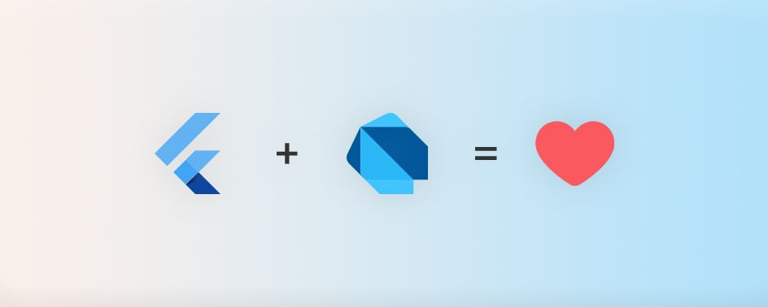
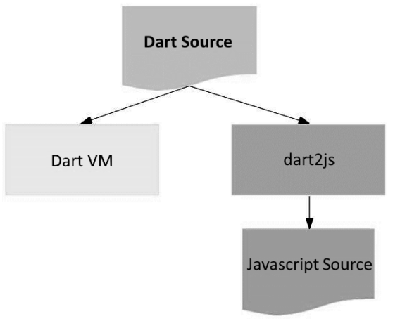

# Week 02 - Tugas Praktikum

## Authors

- [@izamulfikri](https://www.github.com/izamulfikri)

## Pertanyaan & Jawaban

### Soal 1
Membuat modifikasi untuk menampilkan dengan menggunakan perulangan,

**Kode Program mahasiswa.dart**
```dart
class mahasiswa{
  String? nama;
  int? umur;

  mahasiswa(this.nama, this.umur);

  String? getNama(){
    return nama!;
  }

  int? getUmur(){
    return umur!;
  }
}
```

**Kode Program mahasiswa-app.dart**
```dart
import 'mahasiswa.dart';
void main(){
  mahasiswa profil = new mahasiswa("Fikri", 20);

  for(var i = 0; i < 10; i++){
    print('Nama saya adalah ${profil.getNama()}, sekarang berumur ${profil.getUmur()}');
  }
}
```
**Ouput Program**


### Soal 2
Karena semua pengembangan Framework Flutter melibatkan teknologi mendalam dari Pemrograman DART, sehingga sangat penting untuk memahami fundamental atau bagaimana sintaksis dari bahasa DART sehingga ketika mengembangkan suatu aplikasi dengan Framework Flutter dapat dilakukan dengan jauh lebih baik dibandingkan langsung terjun ke Framework Flutter tanpa pengetahuan baik bahasa DART.



### Soal 3
#### Rangkuman Materi
<hr>
Bahasa Dart awalnya dibuat untuk mengatasi kekurangan dari Javascript yang tidak menyediakan ketahanan namun sekarang sudah berkembang untuk pengembangan perangkat mobile termasuk framework Flutter.

Dart memiliki beberapa fitur tingkat tinggi yang digabungkan menjadi kelebihan dari Dart itu sendiri:

- **Productive tooling**: merupakan fitur kakas (tool) untuk menganalisis kode, plugin IDE, dan ekosistem paket yang besar.
- **Garbage collection**: untuk mengelola atau menangani dealokasi memori (terutama memori yang ditempati oleh objek yang tidak lagi digunakan).
Type annotations (opsional): untuk keamanan dan konsistensi dalam mengontrol semua data dalam aplikasi.
- **Statically typed**: Meskipun type annotations bersifat opsional, Dart tetap aman karena menggunakan fitur type-safe dan type inference untuk menganalisis types saat runtime. Fitur ini penting untuk menemukan bug selama kompilasi kode.
- **Portability**: bahasa Dart tidak hanya untuk web (yang dapat diterjemahkan ke JavaScript) tetapi juga dapat dikompilasi secara native ke kode Advanced RISC Machines (ARM) dan x86.

**Dart dapat dieksekusi dengan dua cara:**
- DMS (Dart Virtual Machine)
- JavaScript Compilations




**Eksekusi Dart dapat Dilakukan dengan Dua Cara**
- **Just-In-Time (JIT)**:
Just-In-Time adalah seperti memesan makanan di restoran cepat saji. Ketika Anda memesan makanan, restoran hanya mulai memasaknya ketika Anda memesan, sehingga makanan selalu segar dan tidak ada yang terbuang. Analoginya, JIT dalam pemrograman berarti kode program hanya dijalankan atau dikompilasi saat dibutuhkan, seperti saat Anda memesan makanan. Ini menghemat waktu dan sumber daya komputer.

- **Ahead-Of-Time (AOT)**:
Ahead-Of-Time adalah seperti memasak makanan di rumah sebelumnya dan menyimpannya dalam kotak bekal. Ketika Anda lapar, Anda hanya perlu menghangatkannya di microwave. Analoginya, AOT dalam pemrograman berarti kode program telah dikompilasi sebelum dijalankan, seperti memasak makanan sebelumnya. Ini menghemat waktu saat program dijalankan, tetapi mungkin memerlukan lebih banyak ruang penyimpanan di awal.

**Agaknya Mirip dengan Bahasa Lain (Java, JavaScript)**
- Object Oriented. Jadi DART dirancang untuk konsep Object Oriented Programming
- Dart Operator. `x == 1` seolah-olah anda memanggil `x.==(1)` jadi operator selalu berupa turunan dari kelas yang memiliki method tidak seperti Java yang memiliki data primitif
- Aritmatika Dart sama dengan bahasa lain
- Increment Dart berperilaku mirip dengan bahasa lain
- Operator pada dart tidak membandingkan alamat/referensi memori seperti pada Java atau bahasa lain, melainkan membandingkan isi dari variabel tersebut
- Logical Operator Dart mirip dengan bahasa lain

**Catatan Tambahan untuk Topik Minggu ini**
- Tipe data method perlu didefinisikan seperti mengembailkan nilai atau tidak(void)
- Function Main adalah yang utama dieksekusi
- Selebihnya konsep Function dan Methodnya berperilaku mirip dengan bahasa lain.

### Soal 4
Anggota Kelompok Saya Adalah :
- Mohammad Izamul Fikri Fahmi (2141720171)
- Muhammad Dzaka Murran Rusid (2141720076)

Link Slide dari Canva :
<a href="https://www.canva.com/design/DAFtc00esjY/HbqOsJ2jxFClf_FJUc4gkQ/edit?utm_content=DAFtc00esjY&utm_campaign=designshare&utm_medium=link2&utm_source=sharebutton" title="">Klik untuk Menuju Slide</a>

**Terima Kasih**
