# Week 03 - Tugas Praktikum

## Authors

- [@izamulfikri](https://www.github.com/izamulfikri)

## Tugas 1
Menyelesaikan Praktikum 1 sampai 3 beserta dokumentasi dan penjelasan

### Praktikum 01: Menerapkan Control FLows ("if/else")

**Langkah 01**

```dart
void main(){
  String test = "test2";
if (test == "test1") {
    print("Test1");
} else if (test == "test2") {
    print("Test2");
} else {
    print("Something else");
}

if (test == "test2") print("Test2 again");
}
```

**Langkah 02**

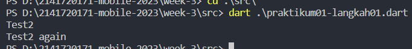


**Langkah 03**
Tambahkan kode program dan lihat hasilnya

```dart
String test = "true";
if (test) {
   print("Kebenaran");
}
```

hasil run

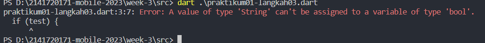

ini terjadi karena yang bisa dicek dalam control flows adalah nilai boolean, sedangkan kode diatas adalah String, solusinya adalah
dengan merubah menjadi seperti berikut:

```dart
  bool test = true;
  if (test) {
    print("kebenaran");
  }
```

maka hasilnya akan menjadi:

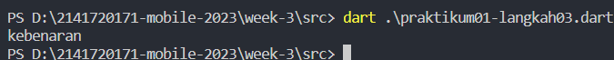


### Praktikum 02: Menerapkan Perulangan "while" dan "do-while"

**Langkah 01**

Ketik atau salin kode program berikut ke dalam fungsi main().
```dart
while (counter < 33) {
  print(counter);
  counter++;
}
```

**Langkah 02**

Silakan coba eksekusi (Run) kode pada langkah 1 tersebut. Apa yang terjadi? Jelaskan! Lalu perbaiki jika terjadi error.
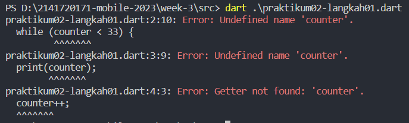
hal ini terjadi karena variable counter belum dideklarasikan, sehingga terjadi error

Solusinya adalah kita deklarasikan terlebih dahulu

```dart
  var counter = 0;
  while (counter < 33) {
  print(counter);
  counter++;
}
```

hasil run

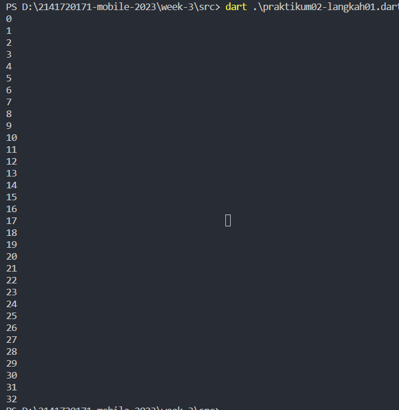

**Langkah 03**

Tambahkan kode program berikut, lalu coba eksekusi (Run) kode Anda.

```dart
do {
  print(counter);
  counter++;
} while (counter < 77);
```

Apa yang terjadi ? Jika terjadi error, silakan perbaiki namun tetap menggunakan do-while.

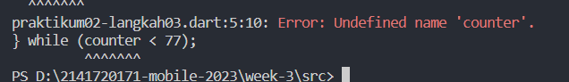

solusinya adalah dengan deklarasi terlebih dahulu dan diberikan nilai = 0

```dart
  var counter = 0;
  do {
  print(counter);
  counter++;
} while (counter < 77);
```

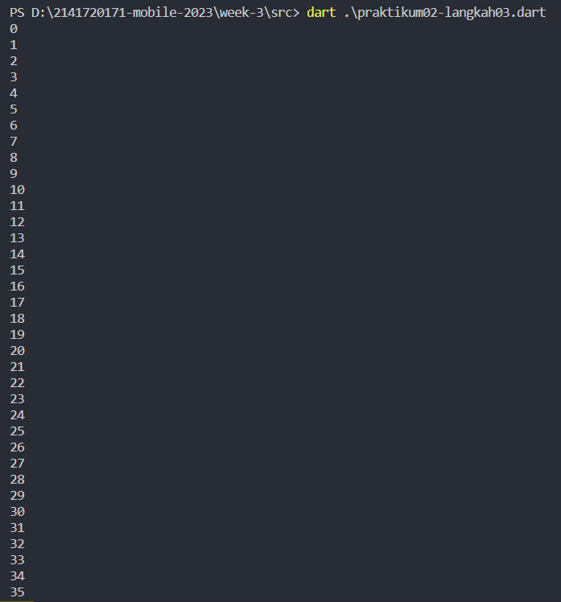


### Praktikum 03: Menerapkan Perulangan "for" dan "break-continue"


**Langkah 01**

Ketik atau salin kode program berikut ke dalam fungsi main().

```dart
for (Index = 10; index < 27; index) {
  print(Index);
}
```

**Langkah 02**
Silakan coba eksekusi (Run) kode pada langkah 1 tersebut. Apa yang terjadi? Jelaskan! Lalu perbaiki jika terjadi error.

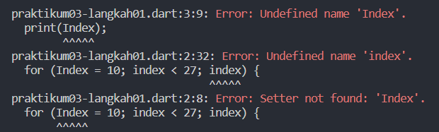

Seperti sebelumnya terjadi error karena belum diberi tipe data untuk Index, juga penulisan Index di sini tidak sama satu sama lainnya, dan ini juga akan terjadi infinite loop karena kita tidak menambah si counter(index). mari kita perbaiki menjadi seperti ini

```dart
  for (var index = 10; index < 27; index++) {
  print(index);
    }
```
dan hasil run akan seperti ini

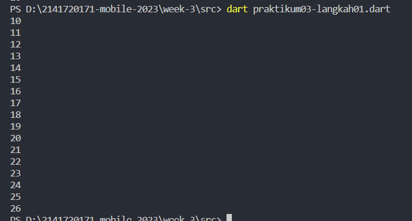

**Langkah 03**

Tambahkan kode program berikut di dalam for-loop, lalu coba eksekusi (Run) kode Anda.


```dart
    if (index == 21) break;
    else if (index > 1 || index < 7) continue;
    print(index);
```

Apa yang terjadi ? Jika terjadi error, silakan perbaiki namun tetap menggunakan for dan break-continue.

tidak terjadi error, tapi karena dalam kode else if, kode program diskip terus karena notasinya adalah OR lebih dari 1 atau kurang dari 7 akan diskip, dan idenya jika 8+ maka akan tetap diskip sampai berhenti dibreak angka 21, jadi kita perlu merubah notasinya

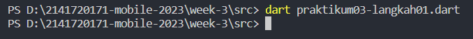

mari kita perbaiki dan lihat hasil runnya
```dart
  for (var index = 10; index < 27; index++) {
    if (index == 21) break;
    else if (index > 1 && index < 7) continue;
    print(index);
```

maka hasil runnya adalah

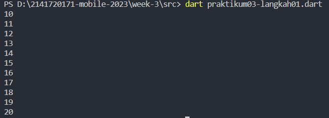


