# Week 04 - Tugas Praktikum

## Authors

- [@izamulfikri](https://www.github.com/izamulfikri)

## Tugas 01
Menyelesaikan Praktikum 1 sampai 5 beserta dokumentasi dan penjelasan

## Praktikum 01: Eksperimen Tipe Data List

**Langkah 01**

```dart
void main() {
  var list = [1, 2, 3];
  assert(list.length == 3);
  assert(list[1] == 2);
  print(list.length);
  print(list[1]);

  list[1] = 1;
  assert(list[1] == 1);
  print(list[1]);
}

```

**Langkah 02**

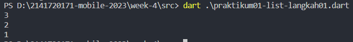


Penjelasan: Kita melakukan percobaan pada list seperti membuat list dengan variable dinamic dan kemudian melakukan pengecekan yang aktif jika dalam mode debug yaitu assert untuk memastikan sesuatu, kemudian kita jika melakukan pengaksesan value dengan memanggil nomor index, dan mengecek panjang dari list dan terkahir kita jika melakukan pergantian value pada list index tertentu karena bukan constant maka bisa dilakukan perubahan.

**Langkah 03**

Ubah kode pada langkah 1 menjadi variabel final yang mempunyai index = 5 dengan default value = null. Isilah nama dan NIM Anda pada elemen index ke-1 dan ke-2. Lalu print dan capture hasilnya.


```dart
void main(){
  final List<dynamic> list = List.filled(5,null);
  assert(list.length == 5);

  list[1] = "Fikri Fahmi";
  list[2] = 2141720171;

  assert(list[1] == "Fikri Fahmi");
  assert(list[2] == 2141720171);

  print(list.length);
  print(list[1]);
}
```

hasil run

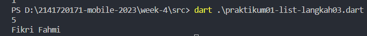

Penjelasan: Tidak terjadi error di sini karena kita membuatnya menjadi dinamic, sehingga bisa terjadi pemberian value yang berbeda-beda seperti String untuk nama atau integer untuk NIM, dan kemudian juga pengecekan assert lolos karena panjangnya memang 5 dan isi dari index tertentu sesuai dengan pembandingnya.

<hr>

## Praktikum 02: Eksperimen Tipe Data Set

**Langkah 01**

Ketik atau salin kode program berikut ke dalam fungsi main().

```dart
void main(){
  var halogens = {'fluorine', 'chlorine', 'bromine', 'iodine', 'astatine'};
print(halogens);
}
```

**Langkah 02**

Silakan coba eksekusi (Run) kode pada langkah 1 tersebut. Apa yang terjadi? Jelaskan! Lalu perbaiki jika terjadi error.
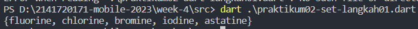

Penjelasan: Kita membuat suatu set dengan value unique(karenan memang seperti itu sifat set), dan kita menampilkannya atau print set itu.

**Langkah 03**

Tambahkan kode program berikut, lalu coba eksekusi (Run) kode Anda.

```dart
void main() {
  var names1 = <String>{};
  Set<String> names2 = {}; // This works, too.
  var names3 = {}; // Creates a map, not a set.

  print(names1);
  print(names2);
  print(names3);
}
```

Apa yang terjadi ? Jika terjadi error, silakan perbaiki namun tetap menggunakan ketiga variabel tersebut. Tambahkan elemen nama dan NIM Anda pada kedua variabel Set tersebut dengan dua fungsi berbeda yaitu .add() dan .addAll(). Untuk variabel Map dihapus, nanti kita coba di praktikum selanjutnya.

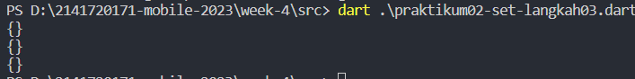

Penjelasan: Di sini tidak terjadi error, karena dart memiliki beberapa cara untuk mendeklarasikan set kosong atau map kosong, dan ketika ditampilkan akan menampilkan isi set/map yang masih kosong.


```dart
void main() {
  var names1 = <String>{};
  Set<String> names2 = {}; // This works, too.
  // var names3 = {}; // Creates a map, not a set.

  print("Sebelum diisi");
  print("--------------------------------");

  print(names1);
  print(names2);
  // print(names3);
  print("");
  print("");
  var namaku = {"Izamul","Fikri","2141720171"};

  names1.add("Mohammad");
  names1.addAll(namaku);
  
  print("Sesudah diisi");
  print("--------------------------------");
  print(names1);

  var namaku2 = {"Fahmi", "Mantappu", "2141720171"};
  names2.add("loginc");
  names2.addAll(namaku2);

  print("--------------------------------");
  print(names2);
}
```

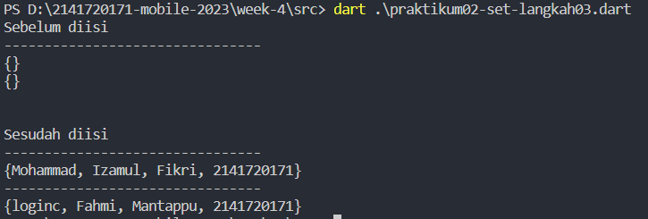

Penjelasan: Kita melakukan pengisian pada Set dengan melakukan pengisian tunggal data aja atau banyak data dengan addAll, perlu diketahui disini addAll menggunakan list/set sebagai parameter pengisian datanya. yang membedakan dengan list di sini adalah kita tidak perlu mengakses nomor index untuk melakukan pengisian.


<hr>

## Praktikum 03: Eksperimen Tipe Data Maps


**Langkah 01**

Ketik atau salin kode program berikut ke dalam fungsi main().

```dart
void main() {
  var gifts = {
    // Key:    Value
    'first': 'partridge',
    'second': 'turtledoves',
    'fifth': 1
  };

  var nobleGases = {
    2: 'helium',
    10: 'neon',
    18: 2,
  };

  print(gifts);
  print(nobleGases);
}
```

**Langkah 02**

Silakan coba eksekusi (Run) kode pada langkah 1 tersebut. Apa yang terjadi? Jelaskan! Lalu perbaiki jika terjadi error.


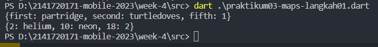

Penjelasan: Tidak terjadi error, jadi maps adalah tipe data yang berlaku key dan value, jadi untuk pengaksesannya nantinya akan menggunakan key.


**Langkah 03**

Tambahkan kode program berikut, lalu coba eksekusi (Run) kode Anda.

```dart
var mhs1 = Map<String, String>();
gifts['first'] = 'partridge';
gifts['second'] = 'turtledoves';
gifts['fifth'] = 'golden rings';

var mhs2 = Map<int, String>();
nobleGases[2] = 'helium';
nobleGases[10] = 'neon';
nobleGases[18] = 'argon';
```

Apa yang terjadi ? Jika terjadi error, silakan perbaiki.

Tambahkan elemen nama dan NIM Anda pada tiap variabel di atas (gifts, nobleGases, mhs1, dan mhs2). Dokumentasikan hasilnya dan buat laporannya!

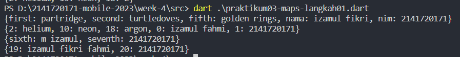

mari kita perbaiki dan lihat hasil runnya
```dart
    gifts['nama'] = 'izamul fikri';
  gifts['nim'] = 2141720171;

  nobleGases[0] = 'izamul fahmi';
  nobleGases[1] = 2141720171;

  mhs1['sixth'] = 'm izamul';
  mhs1['seventh'] = '2141720171';

  mhs2[19] = 'izamul fikri fahmi';
  mhs2[20] = '2141720171';

  print(gifts);
  print(nobleGases);
  print(mhs1);
  print(mhs2);
```

Penjelasan: Pada map tidak ada fungsi untuk Add, sehingga ketika ingin memasukkan suatu key value baru, kita bisa langsung seperti ini ```namaMap[keybaru] = valuebaru```


<hr>

## Praktikum 04: Eksperimen Tipe Data List: Spread dan Control-flow Operators


**Langkah 01**

Ketik atau salin kode program berikut ke dalam fungsi main().

```dart
var list = [1, 2, 3];
var list2 = [0, ...list];
print(list);
print(list2);
print(list2.length);
```

**Langkah 02**

Silakan coba eksekusi (Run) kode pada langkah 1 tersebut. Apa yang terjadi? Jelaskan! Lalu perbaiki jika terjadi error


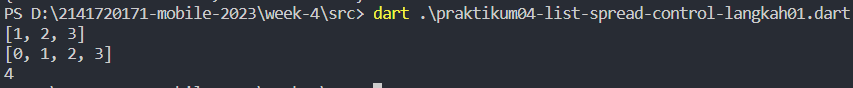

Penjelasan: Kita menggunakan spread operator untuk menggabungkan suatu list

**Langkah 03**

Tambahkan kode program berikut, lalu coba eksekusi (Run) kode Anda.

```dart
var mhs1 = Map<String, String>();
gifts['first'] = 'partridge';
gifts['second'] = 'turtledoves';
gifts['fifth'] = 'golden rings';

var mhs2 = Map<int, String>();
nobleGases[2] = 'helium';
nobleGases[10] = 'neon';
nobleGases[18] = 'argon';
```

Apa yang terjadi ? Jika terjadi error, silakan perbaiki.

Tambahkan elemen nama dan NIM Anda pada tiap variabel di atas (gifts, nobleGases, mhs1, dan mhs2). Dokumentasikan hasilnya dan buat laporannya!

Penjelasan: Sesuai intruksi maka saya mengubah kode program menjadi berikut

```dart
void main() {
  var list1 = [1, 2, null];
  print(list1);
  var list3 = [0, ...?list1];
  print(list3.length);

  var data = ['izamul fikri', 214170271];
  var list4 = [list1, ...?data];

  print(list1);
  print(list3);
  print(list4);
}
```

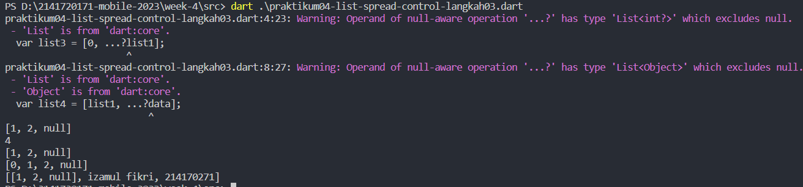

Penjelasan: Terjadi warning karena kita menggunakan null aware untuk bisa menampung data null pada spread

**Langkah 04**

Tambahkan kode program berikut, lalu coba eksekusi (Run) kode Anda.

```dart
var nav = ['Home', 'Furniture', 'Plants', if (promoActive) 'Outlet'];
print(nav);
```

Apa yang terjadi ? Jika terjadi error, silakan perbaiki. Tunjukkan hasilnya jika variabel promoActive ketika true dan false.

Penjelasan: Maka program akan kita ubah menjadi seperti berikut

```dart
void main() {

  print("Jika promo active = true");
  bool promoActive = true;
  var nav = ['Home', 'Furniture', 'Plants', if (promoActive) 'Outlet'];
  print(nav);


  print("Jika promo active = false");
  promoActive = false;
  // ignore: dead_code
  var nav2 = ['Home', 'Furniture', 'Plants', if (promoActive) 'Outlet'];
  print(nav2);
}
```

Maka berikut adalah outputnya

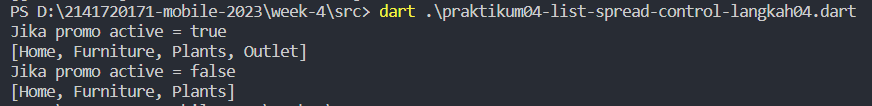

Penjelasan: kita menggunakan control untuk pemberian value pada list

**Langkah 05**

Tambahkan kode program berikut, lalu coba eksekusi (Run) kode Anda.

```dart
var nav2 = ['Home', 'Furniture', 'Plants', if (login case 'Manager') 'Inventory'];
print(nav2);
```

Apa yang terjadi ? Jika terjadi error, silakan perbaiki. Tunjukkan hasilnya jika variabel login mempunyai kondisi lain.

Penjelasan; Untuk membuat program berjalan seperti yang diminta, maka kita akan merubah program menjadi seperti berikut

```dart
void main() {
  var login = 'Manager';

  var nav2 = [
    'Home',
    'Furniture',
    'Plants',
    if (login case 'Manager')
      'Inventory'
    else if (login case 'Employee')
      'Books'
    else
      'Others'
  ];

  print("Jika login = Manager");
  print(nav2);

  login = 'Employee';

  var nav3 = [
    'Home',
    'Furniture',
    'Plants',
    if (login case 'Manager')
      'Inventory'
    else if (login case 'Employee')
      'Books'
    else
      'Others'
  ];

  print("Jika login = Employee");
  print(nav3);

  login = 'King';

  var nav4 = [
    'Home',
    'Furniture',
    'Plants',
    if (login case 'Manager')
      'Inventory'
    else if (login case 'Employee')
      'Books'
    else
      'Others'
  ];

  print("Jika login != Manager && Employee");
  print(nav4);
}
```

Maka berikut adalah outputnya

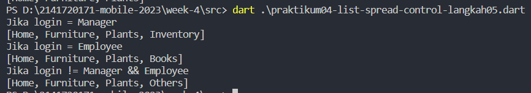

**Langkah 06**

Tambahkan kode program berikut, lalu coba eksekusi (Run) kode Anda.

```dart
var listOfInts = [1, 2, 3];
var listOfStrings = ['#0', for (var i in listOfInts) '#$i'];
assert(listOfStrings[1] == '#1');
print(listOfStrings);
```

Apa yang terjadi ? Jika terjadi error, silakan perbaiki. Jelaskan manfaat Collection For dan dokumentasikan hasilnya.

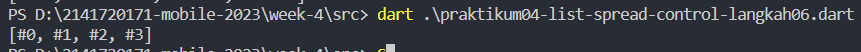

Penjelasan: Jadi collection for digunakan di sini untuk melakukan pengisian pada list dengan melakukan perulangan pada listOfInts


## Praktikum 05: Eksperimen Tipe Data Records

      Catatan: Tipe data Records mulai diperkenalkan pada Dart versi 3.0. Pastikan Anda sudah setup menggunakan Dart 3.0 atau yang lebih baru.

**Langkah 01**

Ketik atau salin kode program berikut ke dalam fungsi main().

```dart
var record = ('first', a: 2, b: true, 'last');
print(record)
```

**Langkah 02**

Silakan coba eksekusi (Run) kode pada langkah 1 tersebut. Apa yang terjadi? Jelaskan! Lalu perbaiki jika terjadi error


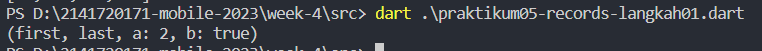

Penjelasan: Records mirip dengan format json, disini kita bisa menggabungkan untuk sekedar list atau bisa gabungan dengan map jadi records bisa lebih bebas datanya.

**Langkah 03**

Tambahkan kode program berikut, lalu coba eksekusi (Run) kode Anda.

```dart
(int, int) tukar((int, int) record) {
  var (a, b) = record;
  return (b, a);
}
```

Apa yang terjadi ? Jika terjadi error, silakan perbaiki. Gunakan fungsi tukar() di dalam main() sehingga tampak jelas proses pertukaran value field di dalam Records.

Penjelasan: Untuk menghasilkan output yang sesuai dengan intruksi mari kita ubah menjadi berikut

```dart
void main() {
  var record = (1,2);
  print(record);

  print("\nSetelah menjalankan fungsi tukar\n");
  var result = (tukar(record));
  print(result);
}

(int, int) tukar((int, int) record) {
  var (a, b) = record;
  return (b, a);
}
```

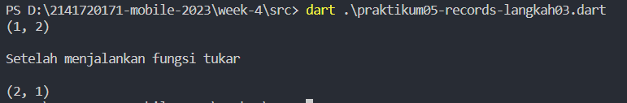

Penjelasan: kita melakukan swap posisi pada tuple

**Langkah 04**

Tambahkan kode program berikut, lalu coba eksekusi (Run) kode Anda.

```dart
// Record type annotation in a variable declaration:
(String, int) mahasiswa;
print(mahasiswa);
```

Apa yang terjadi ? Jika terjadi error, silakan perbaiki. Inisialisasi field nama dan NIM Anda pada variabel record mahasiswa di atas. Dokumentasikan hasilnya dan buat laporannya!

Penjelasan: Untuk menghasilkan output yang sesuai dengan intruksi mari kita ubah menjadi berikut

```dart
void main() {
  // Record type annotation in a variable declaration:
  (String, int) mahasiswa = ('Izamul Fikri', 2141720171);
  print(mahasiswa);
}
```

Maka berikut adalah outputnya

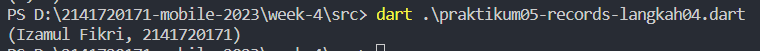

Penjelasan: Ini adalah tuple anotation variable pertama adalah String dan kedua adalah integer

**Langkah 05**

Tambahkan kode program berikut, lalu coba eksekusi (Run) kode Anda.

```dart
var mahasiswa2 = ('first', a: 2, b: true, 'last');

print(mahasiswa2.$1); // Prints 'first'
print(mahasiswa2.a); // Prints 2
print(mahasiswa2.b); // Prints true
print(mahasiswa2.$2); // Prints 'last'
```

Apa yang terjadi ? Jika terjadi error, silakan perbaiki. Gantilah salah satu isi record dengan nama dan NIM Anda, lalu dokumentasikan hasilnya dan buat laporannya!

Penjelasan: Untuk membuat program berjalan seperti yang diminta, maka kita akan merubah program menjadi seperti berikut

```dart
void main() {
  var mahasiswa2 = ('first', a:'Mohammad Izamul Fikri Fahmi', b: true, 2141720171);

  print(mahasiswa2.$1); // Prints 'first'
  print(mahasiswa2.a); // Prints nama
  print(mahasiswa2.b); // Prints true
  print(mahasiswa2.$2); // Prints nim
}
```

Maka berikut adalah outputnya

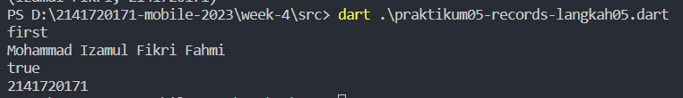


## Tugas 02
Jelaskan yang dimaksud Functions dalam bahasa Dart!

    Jawab: Functions dalam Dart adalah blok kode yang dapat digunakan untuk melakukan tugas atau operasi tertentu. Mereka membantu mengorganisasi kode ke dalam unit yang dapat digunakan kembali. Functions dapat menerima input (parameter) dan menghasilkan output (nilai kembalian), jika yang mengembalikan nilai biasanya ada tipe data di depan nama fungsi, jika tidak maka menggunakan void

## Tugas 03
Jelaskan jenis-jenis parameter di Functions beserta contoh sintaksnya!

    Jawab: Ada tiga jenis parameter di Functions Dart:
    - Required Parameters (Parameter Wajib): Parameter yang mengharuskan kita mengirimkan nilai dalam urutan tertentu saat pemanggilan fungsi.
    Contoh: void contohFungsi(int a, String b) { ... }
    - Optional Parameters (Parameter Opsional): Parameter yang dapat diabaikan saat pemanggilan fungsi.
    Contoh: void contohFungsi({int? a, String? b}) { ... }
    - Positional Parameters (Parameter Posisi): Parameter yang mengharuskan kita mengirimkan nilai dalam urutan tertentu saat pemanggilan fungsi.
    Contoh: void contohFungsi(int a, [String? b]) { ... }

## Tugas 04
Jelaskan maksud Functions sebagai first-class objects beserta contoh sintaknya!

    Jawab: Dalam Dart, Functions dianggap sebagai first-class objects, yang berarti kita dapat memperlakukan Functions seperti tipe data lainnya seperti String atau Integer. Kita dapat menyimpan Functions dalam variabel, mengirimkannya sebagai argumen ke Functions lain, dan mengembalikannya dari Functions lain.

    Contoh:

    var fungsiKu = (int a, int b) => a + b;
    var hasil = fungsiKu(3, 5); // Menjalankan fungsi

## Tugas 05
Apa itu Anonymous Functions? Jelaskan dan berikan contohnya!

    Jawab: Anonymous Functions (atau lambda functions) adalah Functions yang tidak memiliki nama. Mereka sering digunakan untuk operasi singkat dan sederhana. Contohnya adalah fungsi tanpa nama dalam Dart:

```dart 
var fungsiKu = (int a, int b) => a + b;
var hasil = fungsiKu(3, 5); // Menjalankan fungsi
```

## Tugas 06
Jelaskan perbedaan Lexical scope dan Lexical closures! Berikan contohnya!

    Jawab: Lexical Scope (Cakupan Leksikal): Ini mengacu pada sejauh mana variabel dapat diakses dalam kode berdasarkan tempat mereka dideklarasikan. Variabel yang dideklarasikan di luar fungsi dapat diakses dari dalam fungsi tersebut.
    
    Contoh:

```dart
var x = 10;

void contohFungsi() {
  print(x); // Dapat mengakses variabel x yang berada di luar fungsi.
}
```

    Lexical Closures (Penutupan Leksikal): Ini mengacu pada kemampuan fungsi untuk mengakses variabel dari lingkup yang lebih tinggi, bahkan setelah lingkup yang lebih tinggi telah selesai dieksekusi.
    
    Contoh:

```dart
Function contohPenutupan() {
  var x = 10;
  return () {
    print(x); // Fungsi ini memiliki akses ke variabel x dari lingkup yang lebih tinggi.
  };
}
```

## Tugas 07
Jelaskan dengan contoh cara membuat return multiple value di Functions:

    Jawab: Dart tidak mendukung return multiple value seperti beberapa bahasa pemrograman lainnya. Namun, Kita dapat mengembalikan beberapa nilai dalam bentuk List, Map, atau objek khusus yang mengandung beberapa nilai.

    Contoh:

```dart
Map<String, dynamic> contohFungsi() {
  var nama = "John";
  var umur = 30;
  return {'nama': nama, 'umur': umur};
}
```

## Tugas 08
Kumpulkan berupa link commit repo GitHub pada tautan yang telah disediakan di grup Telegram!