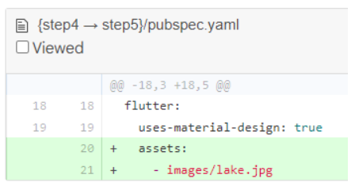

# Week 07 - Layout & Navigasi

## Authors

- [@izamulfikri](https://www.github.com/zenosance)

## Tugas 1
Selesaikan Praktikum 1 sampai 3, lalu dokumentasikan dan push ke repository Anda berupa screenshot setiap hasil pekerjaan beserta penjelasannya di file ```README.md```!


### Tampilan Akhir yang Diharapkan


### Praktikum 01: Membangun Layout di Flutter


**Langkah 01: Buat Project Baru**

Buatlah sebuah project flutter baru dengan nama layout_flutter. Atau sesuaikan style laporan praktikum yang Anda buat.


**Langkah 02: Buka file lib/main.dart**

Buka file ```main.dart``` lalu ganti dengan kode berikut. Isi nama dan NIM Anda di ```text title```.

```dart
import 'package:flutter/material.dart';

void main() => runApp(const MyApp());

class MyApp extends StatelessWidget {
  const MyApp({super.key});

  @override
  Widget build(BuildContext context) {
    return MaterialApp(
      title: 'Flutter layout: IzamulFikri | 2141720171',
      home: Scaffold(
        appBar: AppBar(
          title: const Text('Flutter layout demo'),
        ),
        body: const Center(
          child: Text('Hello World'),
        ),
      ),
    );
  }

```


**Langkah 03: Identifikasi layout diagram**

Langkah pertama adalah memecah tata letak menjadi elemen dasarnya:

- Identifikasi baris dan kolom.
- Apakah tata letaknya menyertakan kisi-kisi (grid)?
- Apakah ada elemen yang tumpang tindih?
- Apakah UI memerlukan tab?

Perhatikan area yang memerlukan alignment, padding, atau borders.
Pertama, identifikasi elemen yang lebih besar. Dalam contoh ini, empat elemen disusun menjadi sebuah kolom: sebuah gambar, dua baris, dan satu blok teks.


Selanjutnya, buat diagram setiap baris. Baris pertama, disebut bagian Judul, memiliki 3 anak: kolom teks, ikon bintang, dan angka. Anak pertamanya, kolom, berisi 2 baris teks. Kolom pertama itu memakan banyak ruang, sehingga harus dibungkus dengan widget yang Diperluas.


Baris kedua, disebut bagian Tombol, juga memiliki 3 anak: setiap anak merupakan kolom yang berisi ikon dan teks.


Setelah tata letak telah dibuat diagramnya, cara termudah adalah dengan menerapkan pendekatan bottom-up. Untuk meminimalkan kebingungan visual dari kode tata letak yang banyak bertumpuk, tempatkan beberapa implementasi dalam variabel dan fungsi.

**Langkah 04: Implementasi title row**

Pertama, Anda akan membuat kolom bagian kiri pada judul. Tambahkan kode berikut di bagian atas metode build() di dalam kelas MyApp:

```dart
Widget titleSection = Container(
  padding: const EdgeInsets.all(...),
  child: Row(
    children: [
      Expanded(
        /* soal 1*/
        child: Column(
          crossAxisAlignment: ...,
          children: [
            /* soal 2*/
            Container(
              padding: const EdgeInsets.only(bottom: ...),
              child: const Text(
                'Wisata Gunung di Batu',
                style: TextStyle(
                  fontWeight: FontWeight.bold,
                ),
              ),
            ),
            Text(
              'Batu, Malang, Indonesia',
              style: TextStyle(...),
            ),
          ],
        ),
      ),
      /* soal 3*/
      Icon(
       ...,
        color: ...,
      ),
      const Text(...),
    ],
  ),
);
```

/* soal 1 */ Letakkan widget Column di dalam widget Expanded agar menyesuaikan ruang yang tersisa di dalam widget Row. Tambahkan properti crossAxisAlignment ke CrossAxisAlignment.start sehingga posisi kolom berada di awal baris.

/* soal 2 */ Letakkan baris pertama teks di dalam Container sehingga memungkinkan Anda untuk menambahkan padding = 8. Teks ‘Batu, Malang, Indonesia' di dalam Column, set warna menjadi abu-abu.

/* soal 3 */ Dua item terakhir di baris judul adalah ikon bintang, set dengan warna merah, dan teks "41". Seluruh baris ada di dalam Container dan beri padding di sepanjang setiap tepinya sebesar 32 piksel. Kemudian ganti isi body text ‘Hello World' dengan variabel titleSection seperti berikut:


*Hasil Pengerjaan Langkah 4*

**Kode Program dalam main.dart**

```dart
import 'package:flutter/material.dart';

void main() => runApp(MyApp());

class MyApp extends StatelessWidget {
  Widget titleSection = Container(
    padding:
        const EdgeInsets.all(16.0), // Jawaban Soal 1: Padding pada Container
    child: Row(
      children: [
        Expanded(
          child: Column(
            crossAxisAlignment: CrossAxisAlignment
                .start, // Jawaban Soal 1: CrossAxisAlignment.start
            children: [
              Container(
                padding: const EdgeInsets.only(
                    bottom: 8.0), // Jawaban Soal 2: Padding pada Container
                child: const Text(
                  'Wisata Kawah Ijen Blue Fire',
                  style: TextStyle(
                    fontWeight: FontWeight.bold,
                  ),
                ),
              ),
              const Text(
                'Banyuwangi, Jawa Timur, Indonesia',
                style: TextStyle(
                  color: Colors.grey, // Jawaban Soal 2: Warna abu-abu
                ),
              ),
            ],
          ),
        ),
        Container(
          padding:
              const EdgeInsets.all(32.0), // Jawaban Soal 3: Padding pada Container
          child: const Row(
            children: [
              Icon(
                Icons.star, // Jawaban Soal 3: Icon bintang
                color: Colors.red, // Jawaban Soal 3: Warna merah
              ),
              Text(
                '41',
                style: TextStyle(
                  fontSize: 16.0, // Ukuran teks
                ),
              ),
            ],
          ),
        ),
      ],
    ),
  );

  MyApp({super.key});

  @override
  Widget build(BuildContext context) {
    return MaterialApp(
      title: 'Flutter layout: Nama dan NIM Anda',
      home: Scaffold(
        appBar: AppBar(
          title: const Text('Flutter layout Izamul Fikri'),
        ),
        body: Column(
          children: [titleSection],
        ),
      ),
    );
  }
}
.
.
...
```


<hr>

### Praktikum 02: Implementasi Button Row 

Selesaikan langkah-langkah praktikum berikut ini dengan melanjutkan dari praktikum sebelumnya.

**Langkah 01: Buat method Column _buildButtonColumn**

Bagian tombol berisi 3 kolom yang menggunakan tata letak yang sama—sebuah ikon di atas baris teks. Kolom pada baris ini diberi jarak yang sama, dan teks serta ikon diberi warna primer.

Karena kode untuk membangun setiap kolom hampir sama, buatlah metode pembantu pribadi bernama buildButtonColumn(), yang mempunyai parameter warna, Icon dan Text, sehingga dapat mengembalikan kolom dengan widgetnya sesuai dengan warna tertentu.

```lib/main.dart (_buildButtonColumn)```

```dart
class MyApp extends StatelessWidget {
  const MyApp({super.key});

  @override
  Widget build(BuildContext context) {
    // ···
  }

  Column _buildButtonColumn(Color color, IconData icon, String label) {
    return Column(
      mainAxisSize: MainAxisSize.min,
      mainAxisAlignment: MainAxisAlignment.center,
      children: [
        Icon(icon, color: color),
        Container(
          margin: const EdgeInsets.only(top: 8),
          child: Text(
            label,
            style: TextStyle(
              fontSize: 12,
              fontWeight: FontWeight.w400,
              color: color,
            ),
          ),
        ),
      ],
    );
  }
}
```

**Langkah 02: Buat widget buttonSection**

Buat Fungsi untuk menambahkan ikon langsung ke kolom. Teks berada di dalam Container dengan margin hanya di bagian atas, yang memisahkan teks dari ikon.

Bangun baris yang berisi kolom-kolom ini dengan memanggil fungsi dan set warna, Icon, dan teks khusus melalui parameter ke kolom tersebut. Sejajarkan kolom di sepanjang sumbu utama menggunakan MainAxisAlignment.spaceEvenly untuk mengatur ruang kosong secara merata sebelum, di antara, dan setelah setiap kolom. Tambahkan kode berikut tepat di bawah deklarasi titleSection di dalam metode build():

**lib/main.dart (buttonSection)**

```dart
Color color = Theme.of(context).primaryColor;

Widget buttonSection = Row(
  mainAxisAlignment: MainAxisAlignment.spaceEvenly,
  children: [
    _buildButtonColumn(color, Icons.call, 'CALL'),
    _buildButtonColumn(color, Icons.near_me, 'ROUTE'),
    _buildButtonColumn(color, Icons.share, 'SHARE'),
  ],
);
```

**Langkah 03: Tambah button section ke body**

Tambahkan variabel buttonSection ke dalam body seperti berikut:


**Hasil Praktikum 2**

*Kode Program main.dart*

```dart
class MyApp extends StatelessWidget {
  Widget titleSection = Container(
    padding:
        const EdgeInsets.all(32.0), // Jawaban Soal 1: Padding pada Container
    child: Row(
      children: [
        Expanded(
          child: Column(
            crossAxisAlignment: CrossAxisAlignment
                .start, // Jawaban Soal 1: CrossAxisAlignment.start
            children: [
              Container(
                padding: const EdgeInsets.only(
                    bottom: 8.0), // Jawaban Soal 2: Padding pada Container
                child: const Text(
                  'Wisata Kawah Ijen Blue Fire',
                  style: TextStyle(
                    fontWeight: FontWeight.bold,
                  ),
                ),
              ),
              const Text(
                'Banyuwangi, Jawa Timur, Indonesia',
                style: TextStyle(
                  color: Colors.grey, // Jawaban Soal 2: Warna abu-abu
                ),
              ),
            ],
          ),
        ),
        /* soal 3*/
        Icon(
          Icons.star,
          color: Colors.red[500],
        ),
        const Text('41'),
      ],
    ),
  );

  MyApp({super.key});

  @override
  Widget build(BuildContext context) {
    Color color = Theme.of(context).primaryColor;

    Widget buttonSection = Row(
      mainAxisAlignment: MainAxisAlignment.spaceEvenly,
      children: [
        _buildButtonColumn(color, Icons.call, 'CALL'),
        _buildButtonColumn(color, Icons.near_me, 'ROUTE'),
        _buildButtonColumn(color, Icons.share, 'SHARE'),
      ],
    );

    return MaterialApp(
      title: 'Flutter layout: Nama dan NIM Anda',
      home: Scaffold(
        appBar: AppBar(
          title: const Text('Flutter layout Izamul Fikri'),
        ),
        body: Column(
          children: [titleSection,buttonSection],
        ),
      ),
    );
  }

  Column _buildButtonColumn(Color color, IconData icon, String label) {
    return Column(
      mainAxisSize: MainAxisSize.min,
      mainAxisAlignment: MainAxisAlignment.center,
      children: [
        Icon(icon, color: color),
        Container(
          margin: const EdgeInsets.only(top: 8),
          child: Text(
            label,
            style: TextStyle(
              fontSize: 12,
              fontWeight: FontWeight.w400,
              color: color,
            ),
          ),
        ),
      ],
    );
  }
}
.
.
...
```

*Hasil*


<hr>

### Praktikum 03: Implementasi text section

Selesaikan langkah-langkah praktikum berikut ini dengan melanjutkan dari praktikum sebelumnya.

**Langkah 01: Buat class VerificationCodeInput**

Tentukan bagian teks sebagai variabel. Masukkan teks ke dalam Container dan tambahkan padding di sepanjang setiap tepinya. Tambahkan kode berikut tepat di bawah deklarasi buttonSection:

```dart
Widget textSection = Container(
  padding: const EdgeInsets.all(32),
  child: const Text(
    'Carilah teks di internet yang sesuai '
    'dengan foto atau tempat wisata yang ingin '
    'Anda tampilkan. '
    'Tambahkan nama dan NIM Anda sebagai '
    'identitas hasil pekerjaan Anda. '
    'Selamat mengerjakan 🙂.',
    softWrap: true,
  ),
);
```

Dengan memberi nilai softWrap = true, baris teks akan memenuhi lebar kolom sebelum membungkusnya pada batas kata.

**Langkah 02: Tambahkan variabel text section ke body**

Tambahkan widget variabel textSection ke dalam body seperti berikut:


*Hasil*


<hr>

### Praktikum 04: Implementasi image section

Selesaikan langkah-langkah praktikum berikut ini dengan melanjutkan dari praktikum sebelumnya.

**Langkah 1: Siapkan aset gambar**

Anda dapat mencari gambar di internet yang ingin ditampilkan. Buatlah folder images di root project layout_flutter. Masukkan file gambar tersebut ke folder images, lalu set nama file tersebut ke file pubspec.yaml seperti berikut:



Contoh nama file gambar di atas adalah lake.jpg

    Tips

    - Perhatikan bahwa pubspec.yaml sensitif terhadap huruf besar-kecil, jadi tulis assets: dan URL gambar seperti yang ditunjukkan di atas.
    - File pubspec juga sensitif terhadap spasi, jadi gunakan indentasi yang tepat.
    - Anda mungkin perlu memulai ulang program yang sedang berjalan (baik di simulator atau perangkat yang terhubung) agar perubahan pubspec dapat diterapkan.

**Langkah 2: Tambahkan gambar ke body**

Tambahkan aset gambar ke dalam body seperti berikut:


BoxFit.cover memberi tahu kerangka kerja bahwa gambar harus sekecil mungkin tetapi menutupi seluruh kotak rendernya.


**Langkah 3: Terakhir, ubah menjadi ListView**

Pada langkah terakhir ini, atur semua elemen dalam ListView, bukan Column, karena ListView mendukung scroll yang dinamis saat aplikasi dijalankan pada perangkat yang resolusinya lebih kecil.


*Hasil*


<hr>

## Tugas Praktikum

1. Selesaikan Praktikum 1 sampai 4, lalu dokumentasikan dan push ke repository Anda berupa screenshot setiap hasil pekerjaan beserta penjelasannya di file README.md!

    jawab: Done

2. Silakan implementasikan di project baru "basic_layout_flutter" dengan mengakses sumber ini: https://docs.flutter.dev/codelabs/layout-basics

    jawab: Masih sedang dicicil

3. Kumpulkan link commit repository GitHub Anda ke spreadsheet yang telah disediakan!