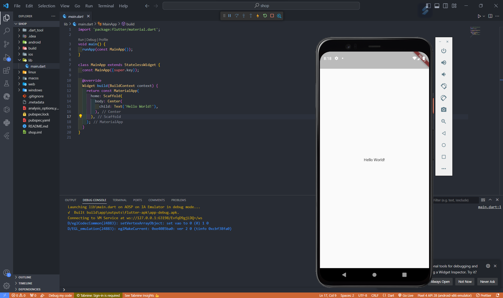
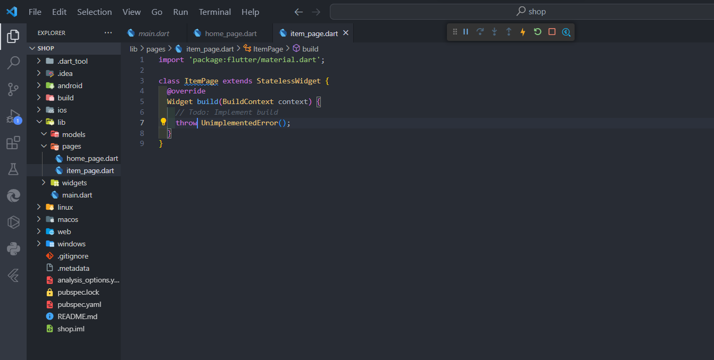
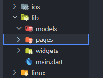
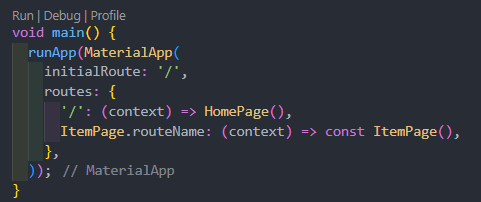
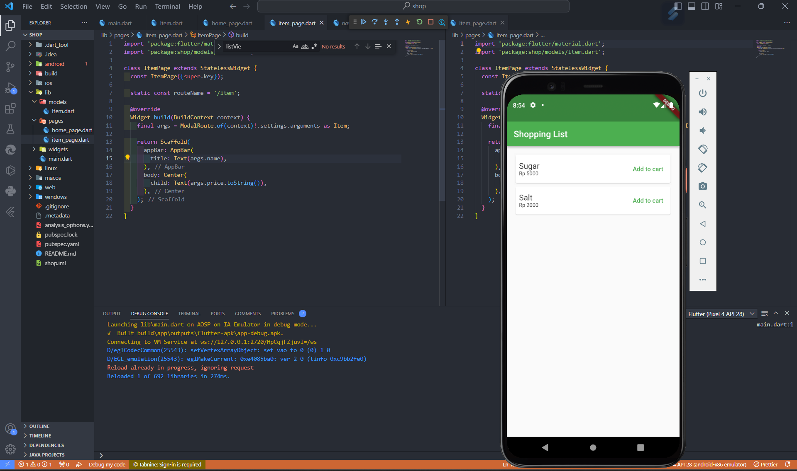

# Week 8 - Flutter: Konsep Navigasi dan Rute

Di minggu kedelapan ini, mahasiswa akan mempelajari perpindahan halaman di Flutter menggunakan navigasi dan rute dengan konsep stack.

## Authors

- [@izamulfikri](https://www.github.com/zenosance)

## Praktikum 1: Membangun Navigasi di Flutter

### Langkah 1: Siapkan Project Baru
Sebelum melanjutkan praktikum, buatlah sebuah project baru Flutter dengan nama belanja dan susunan folder seperti pada gambar.





Susunan folder:



### Langkah 2: Mendifinisikan Route
Kita membuat dua buah file dart dengan nama ```home_page.dart``` dan ```item_page.dart``` pada folder pages. Kemudian, untuk masing-masing file, deklarasikan class ```HomePage``` pada fie ```home_page.dart``` dan ```ItemPage``` pada ```item_page.dart```. Turunkan class dari stateless widget. Berikut potongan code program:




### Full code untuk main.dart

```dart
import 'package:flutter/material.dart';
import 'package:shop/pages/home_page.dart';
import 'pages/item_page.dart';

void main() {
  runApp(MaterialApp(
    initialRoute: '/',
    routes: {
      '/': (context) => HomePage(),
      ItemPage.routeName: (context) => const ItemPage(),
    },
  ));
}

class MainApp extends StatelessWidget {
  const MainApp({super.key});

  @override
  Widget build(BuildContext context) {
    return MaterialApp(
      home: Scaffold(
          appBar: AppBar(
        title: const Text('Shopping List'),
      )),
    );
  }
}
```

### home_page.dart
```dart
import 'package:flutter/material.dart';
import 'package:shop/models/Item.dart';
import 'package:shop/pages/item_page.dart';

class HomePage extends StatelessWidget {
  HomePage({super.key});

  final List<Item> Items = [
    Item(name: 'Sugar', price: 5000),
    Item(name: 'Salt', price: 2000),
  ];

  @override
  Widget build(BuildContext context) {
    return MaterialApp(
      home: Scaffold(
          appBar: AppBar(
            backgroundColor: Colors.green,
            title: const Text('Shopping List'),
          ),
          body: Container(
            margin: const EdgeInsets.all(8),
            child: ListView.builder(
              padding: const EdgeInsets.all(8),
              itemCount: Items.length,
              itemBuilder: (context, index) {
                final item = Items[index];
                return InkWell(
                  onTap: () {
                    Navigator.pushNamed(context, ItemPage.routeName,
                        arguments: Item(
                          name: item.name,
                          price: item.price,
                        ));
                  },
                  child: Card(
                    child: Container(
                      margin: const EdgeInsets.all(8),
                      child: Row(
                        children: [
                          Expanded(
                            child: Column(
                              crossAxisAlignment: CrossAxisAlignment.start,
                              children: [
                                Text(
                                  item.name,
                                  style: const TextStyle(fontSize: 18),
                                ),
                                Text(
                                  'Rp ${item.price}',
                                  style: const TextStyle(fontSize: 12),
                                ),
                              ],
                            ),
                          ),
                          TextButton(
                            style: const ButtonStyle(
                                foregroundColor:
                                    MaterialStatePropertyAll(Colors.green)),
                            onPressed: () {},
                            child: const Text('Add to cart'),
                          ),
                        ],
                      ),
                    ),
                  ),
                );
              },
            ),
          )),
    );
  }
}
```


### item_page.dart

```dart
import 'package:flutter/material.dart';
import 'package:shop/models/Item.dart';

class ItemPage extends StatelessWidget {
  const ItemPage({super.key});

  static const routeName = '/item';

  @override
  Widget build(BuildContext context) {
    final args = ModalRoute.of(context)!.settings.arguments as Item;

    return Scaffold(
      appBar: AppBar(
        title: Text(args.name),
      ),
      body: Center(
        child: Text(args.price.toString()),
      ),
    );
  }
}
```

### Item.dart

```dart
class Item {
  final String name;
  final int price;

  Item({required this.name, required this.price});
}
```

### Hasil Praktikum sampai Langkah 6



