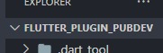
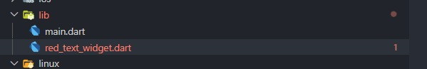
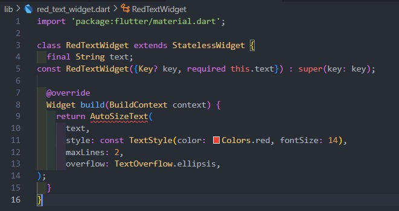
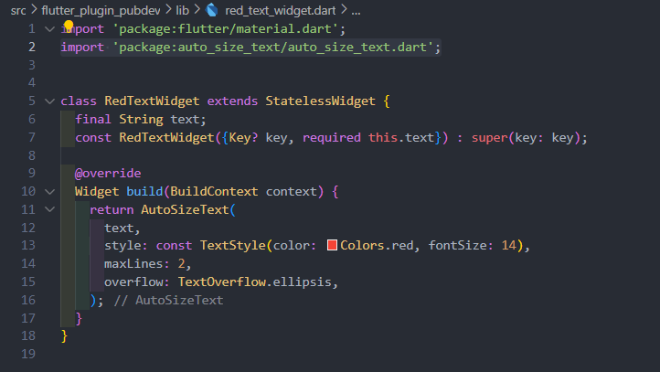
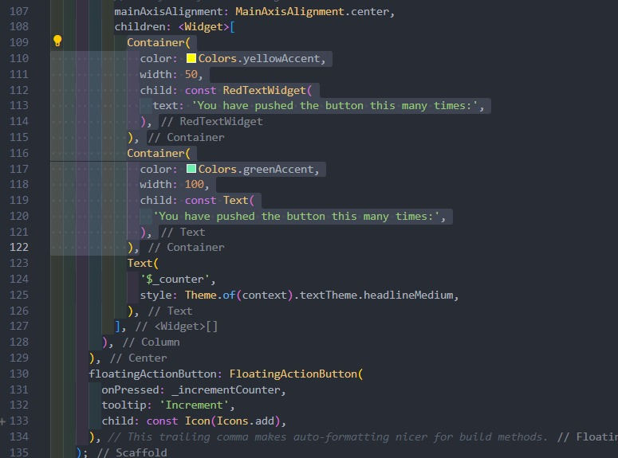
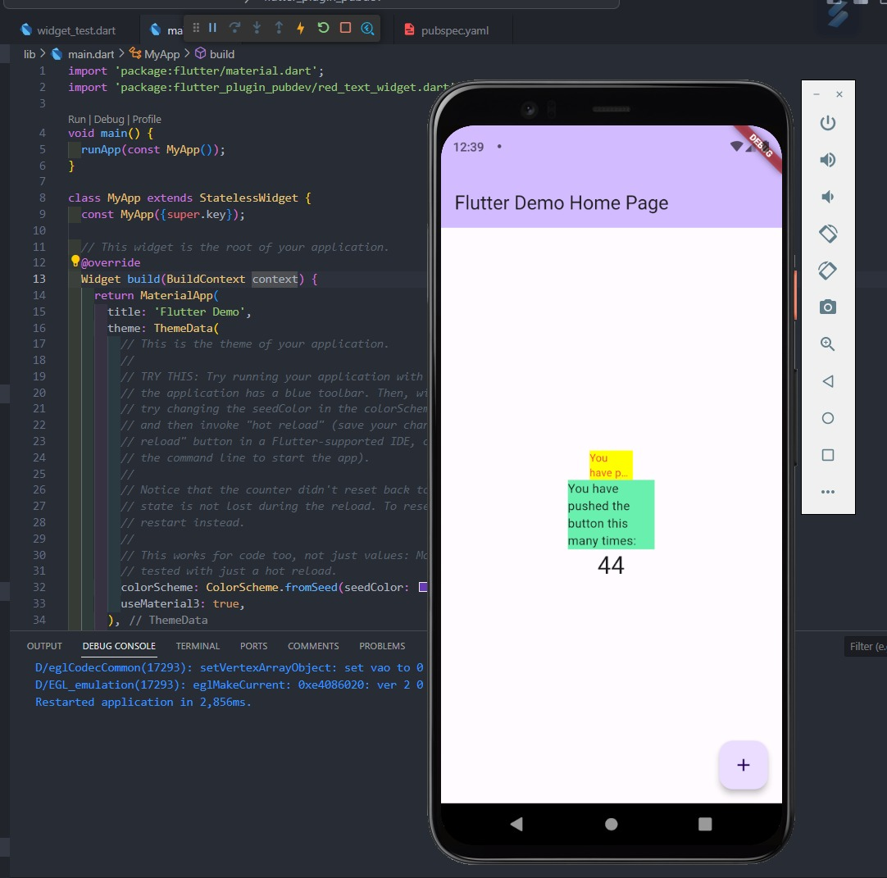

# Week 9 - Menerapkan Plugin di Project Flutter

Selesaikan langkah-langkah praktikum berikut ini menggunakan editor Visual Studio Code (VS Code) atau Android Studio atau code editor lain kesukaan Anda.

## Authors

- [@izamulfikri](https://www.github.com/zenosance)

## Praktikum 1: Menerapkan Plugin di Project Flutter

### Langkah 1: Siapkan Project Baru
Buatlah sebuah project flutter baru dengan nama flutter_plugin_pubdev. Lalu jadikan repository di GitHub Anda dengan nama flutter_plugin_pubdev.



### Langkah 2: Menambahkan Plugin
Tambahkan plugin auto_size_text menggunakan perintah berikut di terminal

```dart
flutter pub add auto_size_text
```

Jika berhasil, maka akan tampil nama plugin beserta versinya di file pubspec.yaml pada bagian dependencies.


### Langkah 3: Buat file red_text_widget.dart

Buat file baru bernama ```red_text_widget.dart``` di dalam folder lib lalu isi kode seperti berikut.



```dart
import 'package:flutter/material.dart';

class RedTextWidget extends StatelessWidget {
  const RedTextWidget({Key? key}) : super(key: key);

  @override
  Widget build(BuildContext context) {
    return Container();
  }
}
```

### Langkah 4: Tambah Widget AutoSizeText

Masih di file ```red_text_widget.dart```, untuk menggunakan plugin ```auto_size_text```, ubahlah kode ```return Container()``` menjadi seperti berikut.

```dart
return AutoSizeText(
      text,
      style: const TextStyle(color: Colors.red, fontSize: 14),
      maxLines: 2,
      overflow: TextOverflow.ellipsis,
);
```



Setelah Anda menambahkan kode di atas, Anda akan mendapatkan info error. Mengapa demikian? Jelaskan dalam laporan praktikum Anda!

**Jawab**

Karena ketika kita menambahkan sebuah plugin mungkin plugin yang kita tambah memiliki versi yang tidak sesuai sehingga terjadi error, solusinya kita jalankan pada terminal ```flutter pub get```

dan jangan lupa import ini di bagian atas:

```dart
import 'package:auto_size_text/auto_size_text.dart';
```

dan error pun akan hilang:



### Langkah 5: Buat Variabel text dan parameter di constructor

Tambahkan variabel ```text``` dan parameter di constructor seperti berikut.

```dart
final String text;

const RedTextWidget({Key? key, required this.text}) : super(key: key);
```


### Langkah 6: Tambahkan widget di main.dart

Buka file ```main.dart``` lalu tambahkan di dalam ```children:``` pada ```class _MyHomePageState```

```dart
Container(
   color: Colors.yellowAccent,
   width: 50,
   child: const RedTextWidget(
             text: 'You have pushed the button this many times:',
          ),
),
Container(
    color: Colors.greenAccent,
    width: 100,
    child: const Text(
           'You have pushed the button this many times:',
          ),
),
```



**Run** aplikasi tersebut dengan tekan **F5,** maka hasilnya akan seperti berikut.




## Tugas Praktikum

1. Selesaikan Praktikum tersebut, lalu dokumentasikan dan push ke repository Anda berupa screenshot hasil pekerjaan beserta penjelasannya di file ```README.md```!

    **jawab:** Sudah selesai, siap akan Saya push hasil pengerjaannya.

2. Jelaskan maksud dari langkah 2 pada praktikum tersebut!

    **jawab:** Perintah ini bertujuan untuk menambahkan atau menginstal plugin bernama "auto_size_text" ke dalam proyek Flutter yang sedang dikerjakan. Plugin ini, seperti namanya, digunakan untuk mengatur ukuran teks secara otomatis sesuai dengan ruang yang tersedia di widget atau elemen yang digunakan dalam tampilan aplikasi.

3. Jelaskan maksud dari langkah 5 pada praktikum tersebut!

    **jawab:** Variabel text merupakan sebuah string yang akan digunakan dalam widget ini untuk menampilkan teks. Parameter dalam constructor RedTextWidget digunakan untuk menginisialisasi nilai variabel text ketika widget ini dibuat. Parameter required menandakan bahwa nilai text harus disediakan saat widget ini dibuat, dan tidak boleh kosong. Variabel Text akan digunakan untuk keperluan text yang digunakan oleh plugin yang sudah ditambahkan sebelumnya

4. Pada langkah 6 terdapat dua widget yang ditambahkan, jelaskan fungsi dan perbedaannya!

    **jawab:** Pada langkah 6, saya menambahkan dua Container ke dalam children pada class _MyHomePageState. Yang pertama berisi RedTextWidget, yaitu custom widget yang saya buat sendiri untuk menampilkan teks dengan gaya khusus seperti teks merah, sementara yang kedua berisi widget bawaan Flutter, yaitu Text, untuk menampilkan teks umum. Container pertama memiliki latar belakang kuning dan lebar 50, sedangkan Container kedua memiliki latar belakang hijau dan lebar 100. Dengan demikian, perbedaannya terletak pada customisasi dan tampilan visual, di mana RedTextWidget memberikan kemampuan penyesuaian khusus dalam menampilkan teks, sementara widget Text hanya menampilkan teks tanpa penyesuaian khusus.

5. Jelaskan maksud dari tiap parameter yang ada di dalam plugin auto_size_text berdasarkan tautan pada dokumentasi [ini](https://pub.dev/documentation/auto_size_text/latest/) !

    **jawab:** 
    
    **text**: Parameter ini adalah teks yang akan ditampilkan oleh widget AutoSizeText. Ini adalah teks yang akan diukur dan diatur ukurannya agar sesuai dengan ruang yang tersedia.

    **style**: Parameter ini digunakan untuk mengatur gaya teks, seperti warna dan ukuran font. Dalam contoh ini, teks akan ditampilkan dengan warna merah dan ukuran font 14.

    **maxLines**: Parameter ini mengatur jumlah maksimum baris teks yang dapat ditampilkan sebelum teks dipotong atau diakhiri dengan tanda elipsis (titik-titik). Dalam contoh ini, teks akan diatur agar tidak melebihi 2 baris.

    **overflow**: Parameter ini mengatur bagaimana teks akan ditampilkan jika melebihi jumlah maksimum baris yang telah ditentukan oleh maxLines. Dalam contoh ini, jika teks melebihi 2 baris, maka akan ditampilkan dengan tanda elipsis sebagai indikasi bahwa teks terpotong.

6. Kumpulkan laporan praktikum Anda berupa link repository GitHub ke spreadsheet yang telah disediakan!

    **jawab:** Siap sudah.